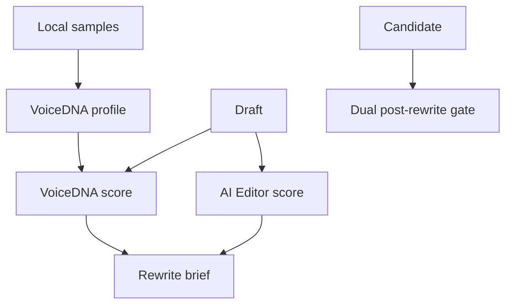

# holdyourvoice

A local-first writing gate with two separate opinions about a draft:

- **VoiceDNA** measures drift from a profile built from your own local samples.
- **AI Editor** flags versioned, generic AI-writing patterns.

They never share a score. `analyze` reports both; `rewrite-prompt` turns both evidence sets into one bounded editing brief; `verify` re-runs both engines and fails when either gate fails, a critical regression appears, or key terms disappear.

## Quick start

```bash
npm install
npm test
npx holdyourvoice profile profile.json samples/one.md samples/two.md
npx holdyourvoice analyze draft.md profile.json
npx holdyourvoice rewrite-prompt draft.md profile.json > rewrite-brief.md
npx holdyourvoice verify draft.md candidate.md profile.json
```

No account, API, MCP server, telemetry, or network request is part of this project.

## How it works



Read [the thesis](docs/THESIS.md), [architecture](docs/ARCHITECTURE.md), [VoiceDNA reference](docs/VOICE-DNA.md), [pattern taxonomy](docs/PATTERN-TAXONOMY.md), and [benchmark policy](docs/BENCHMARKS.md) before extending the gate.

## Privacy and data rights

Profiles are generated from files you choose and are never uploaded by this code. Do not commit client samples, edit history, embeddings, or any dataset without explicit rights and a provenance record.
