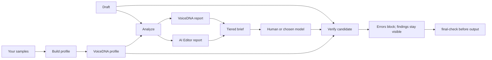

# Hold Your Voice

[](https://www.npmjs.com/package/@holdyourvoice/hyv)

Hold Your Voice is a local-first writing gate. It helps you use AI without losing the parts of your writing that make it yours.

It runs two checks on a draft, with separate scores and pass states. A strong result in one engine leaves the other engine's finding unchanged.

- **VoiceDNA** compares your draft with observable elements from your own writing samples.
- **AI Editor** flags a versioned set of editorial patterns that make writing sound generic or formulaic.

Everything runs from local files. There are no accounts, no telemetry, and no runtime network requests. The optional Claude extension is a local adapter around the same engine.

> **Status:** [`@holdyourvoice/hyv`](https://www.npmjs.com/package/@holdyourvoice/hyv) runs locally and makes no runtime network requests.

## Start here

**Requirements:** Node.js 20+, npm, and at least two writing samples you have the right to use.

### Install

```bash
npm install --global @holdyourvoice/hyv
hyv patterns
```

No global install? Run any command with `npx @holdyourvoice/hyv`.

### Build a profile

```bash
hyv profile profile.json samples/one.md samples/two.md --avoid=overused-phrase
```

Use writing by one person, with a similar audience and format. The command needs at least two samples. It writes a portable JSON profile and keeps your samples on your machine. Repeat `--avoid=phrase` for each phrase that must block a candidate.

### Analyze a draft

```bash
hyv analyze draft.md profile.json
```

The result is JSON with independent reports. The outer `passed` field is true only when each engine passes.

```json
{
  "voiceDna": { "score": 93, "passed": true, "findings": [] },
  "aiEditor": { "score": 88, "passed": true, "findings": [] },
  "hygiene": { "suspiciousCount": 0, "fixableCount": 0, "hits": [] },
  "passed": true
}
```

### Edit and verify

```bash
hyv rewrite-prompt draft.md profile.json > rewrite-brief.md
hyv verify draft.md candidate.md profile.json
```

Give the brief and draft to a human editor or any model you trust. Ask for replacement sentences keyed by sentence number, then save them as a separate candidate file. `verify` compares the original and candidate, reports new findings, and exits `2` when the candidate fails the gate.

### Gate final output

```bash
producer | hyv final-check -
hyv final-check final-response.md
```

`final-check` is the last step before text reaches a user. It needs no profile. Clean text goes to stdout byte-for-byte. If hidden Unicode remains, stdout stays empty and the command exits `2`. Run it after the last edit, formatter, or template expansion.

### Clean hidden Unicode

```bash
hyv hygiene draft.md
hyv hygiene draft.md --fix
```

Inspect zero-width characters, bidirectional controls, tag characters, and unusual spaces. Add `--fix` to write a cleaned copy while leaving the original untouched. The cleaner only removes non-semantic ASCII controls and byte-order marks; everything else is reported for review because it can carry real meaning.

## The editing loop



The tool never edits your draft. You decide which findings are valid, apply the changes yourself, and run the final check.

## A few more commands

| Command | Use it when |
| --- | --- |
| `hyv verify-spec` | A draft has facts that must stay verbatim (CopySpec). |
| `hyv fact-lint` | Check a draft against local evidence sources. |
| `hyv batch-analyze` | Catch exact repeated sentences across drafts. |
| `hyv prepare-rewrite` / `apply-rewrite` | Fingerprint-bound sentence or range edits. |
| `hyv prepare-rebuild` / `apply-rebuild` | Whole-document rebuild after an authorized recommendation. |
| `hyv prepare-judgment` / `reduce-judgment` | Reduce findings to SHIP, EDIT, or REBUILD. |
| `hyv lifecycle` | Semantic and human-review lifecycle steps. |
| `hyv learning show` | Inspect local voice-memory preferences. |

## Commands

| Command | Input | Output |
| --- | --- | --- |
| `hyv profile <profile.json> <sample...>` | Two or more text files | Profile JSON |
| `hyv analyze <draft> <profile.json>` | Draft and profile | Analysis JSON |
| `hyv hygiene <draft> [--fix] [--output=path]` | Draft | Hygiene report or cleaned copy plus receipt |
| `hyv inspect-hidden-text <draft> [policy.json]` | Draft and optional policy | Hidden-text inspection report |
| `hyv apply-hidden-text-policy <draft> <policy.json> <output.md>` | Draft and approved policy | Sanitized output plus receipt |
| `hyv final-check <path\|->` | Any final text | Accepted text on stdout or a withheld-output report |
| `hyv logic-lint <draft\|-> [writing-brief.json]` | Draft and optional brief | Deterministic logic-lint report |
| `hyv rewrite-prompt <draft> <profile.json>` | Draft and profile | Markdown editing brief |
| `hyv prepare-rewrite <draft> <profile.json> <task.json>` | Draft and profile | Versioned task file |
| `hyv apply-rewrite <task.json> <response.json> <profile.json>` | Task, response, profile | Candidate evaluation JSON |
| `hyv prepare-judgment <pre-edit\|post-candidate> <kind> <draft> <profile.json> <task.json> [candidate.md]` | Draft, profile, optional candidate | Versioned judgment task |
| `hyv reduce-judgment <envelope.json> ...` | Signed judgment envelopes | Recommendation JSON |
| `hyv prepare-rebuild <draft> <profile.json> <reduction.json> <copy-spec.json> <task.json> [--recomposition-policy policy.json]` | Draft, recommendation, CopySpec, capability, optional policy | Versioned rebuild task |
| `hyv rebuild-writer-request <task.json> <writer-request.json>` | Rebuild task | Writer-only rebuild request |
| `hyv apply-rebuild <task.json> <response.json> <profile.json>` | Task, response, profile, capability | Candidate evaluation JSON |
| `hyv verify <original> <candidate> <profile.json>` | Original, candidate, profile | Verification JSON and exit code |
| `hyv verify-spec <original> <candidate> <profile.json> <copy-spec.json>` | Original, candidate, profile, CopySpec | Verification JSON with hard claim gate |
| `hyv learning <show\|inspect\|add\|record\|record-approved\|ratify\|supersede\|migrate\|clear> ...` | Profile, operation, bounded metadata | Preferences or a text-free receipt |
| `hyv lifecycle <prepare-semantic\|submit-verdict\|inspect\|validate-final-approval\|finalize> ...` | Versioned lifecycle artifacts | Lifecycle artifact or metadata |
| `hyv patterns` | None | Ruleset JSON |
| `hyv mcp` | None | Local MCP server on stdio |
| `hyv agent list\|validate\|describe\|emit <id> [--host HOST] [--mode prompt\|json] [--output FILE]` | Optional agent id | Portable agent contract (see below) |

Every file argument can be `-` when the command accepts input on standard input. Use `npx @holdyourvoice/hyv <command>` if you have not installed the CLI globally.

## Portable agents

The 23 writing and runtime commands are also model-neutral portable agent packages under `skills/hyv-*/` (an `agent.json` contract, a `SKILL.md`, and an `agents/openai.yaml` interface), mirroring the clean-code portable-agent pattern. `hyv agent list` prints every package; `hyv agent validate [id]` checks the contract schema; `hyv agent describe <id> --host HOST` resolves permissions against a host catalog; and `hyv agent emit <id> --mode prompt|json --host HOST` emits a host-aware contract. The subcommand stays local. `emit --output` creates a new contract file and refuses an existing target. Read the [portable agents guide](docs/wiki/Portable-Agents.md) for the package contract, host model, and examples.

## Privacy

Your samples, drafts, profiles, and candidates stay on your machine. Verification is read-only. Learning commands can write text-free local events under `~/.hyv/learning/` — profile fingerprint, finding IDs, counts, and an opaque digest. No writing text is uploaded, and the package makes no runtime network requests.

Keep writing samples, edit histories, and client text out of public commits unless you hold the rights and a provenance record. A profile is aggregated JSON and can still reveal vocabulary, so store private profiles outside public repositories.

## Documentation

| Read this | When you need |
| --- | --- |
| [The Wiki](https://github.com/shashank-sn/holdyourvoice/wiki) | Product and contributor docs. |
| [Architecture](docs/ARCHITECTURE.md) | Source boundaries and extension rules. |
| [Prompt contract](docs/PROMPT-CONTRACT.md) | The tier order and editing constraints. |
| [VoiceDNA](docs/VOICE-DNA.md) | The 13 profile elements. |
| [Fact linter](docs/wiki/Fact-Linter.md) | The source-consistency checker. |
| [Portable agents](docs/wiki/Portable-Agents.md) | Load or emit a host-aware contract for one HYV command. |
| [Support](SUPPORT.md) | Funding without a feature gate. |

## Contribute

```bash
npm test
npm run check:release
```

Read [CONTRIBUTING.md](CONTRIBUTING.md) before opening a pull request. Keep changes narrow, add tests when behavior changes, and keep private or unlicensed material out of the repo.

`@holdyourvoice/hyv` publishes automatically when a change reaches `main`. Bump the version in `package.json` in the same pull request as a release-worthy change; the workflow publishes only if that version is not already on npm.

## License

[MIT](LICENSE). Third-party writing and data retain their own rights.
