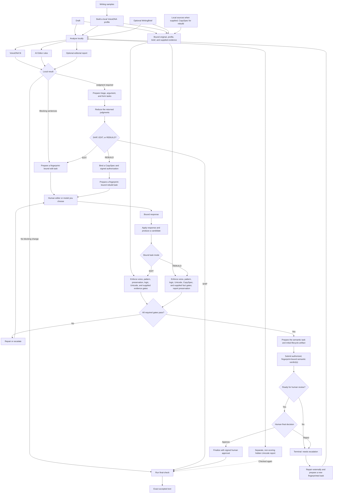

# Hold Your Voice

[](https://www.npmjs.com/package/@holdyourvoice/hyv)

Hold Your Voice (`hyv`) is a local writing checker. It helps you edit AI-assisted writing without losing your own writing patterns.

It runs two independent checks:

- VoiceDNA compares a draft with a profile built from your writing samples.
- AI Editor finds deterministic patterns that often make writing generic or formulaic.

The package also checks hidden Unicode, source-backed facts, document logic, and protected claims. All checks run locally, without model calls, automatic draft changes, or runtime network requests.

## how it works



This combines the basic no-change path with the full fingerprint-bound edit and rebuild paths. HYV prepares tasks, validates returned artifacts, and runs deterministic checks locally. It never calls a model: a human editor or model you choose supplies edits and judgments. The basic CLI path below uses `analyze`, `verify`, and `final-check`.

## install

You need Node.js 20 or newer and at least two writing samples you have the right to use.

```bash
npm install --global @holdyourvoice/hyv
```

For a one-off command, replace `hyv` with `npx @holdyourvoice/hyv`.

## basic workflow

1. Build a local profile from your samples.

```bash
hyv profile profile.json samples/one.md samples/two.md
```

Add `--avoid=phrase` for wording that must block a draft. Repeat the option for more phrases.

2. Check a draft against that profile.

```bash
hyv analyze draft.md profile.json
```

The result contains separate VoiceDNA and AI Editor reports. The top-level `passed` value is true only when every required check passes.

3. Create an editing brief, edit the draft, and verify the candidate.

```bash
hyv rewrite-prompt draft.md profile.json > rewrite-brief.md
hyv verify draft.md candidate.md profile.json
```

Send the brief to a human editor or a model you choose. Delivery stays under your control.

4. Check the exact text before delivery.

```bash
hyv final-check candidate.md
producer | hyv final-check -
```

`final-check` writes accepted text to stdout. It withholds output and exits with code `2` when unresolved hidden Unicode remains.

## commands

| Command | Purpose |
| --- | --- |
| `hyv profile <profile.json> <sample...>` | Build a local profile from two or more samples. |
| `hyv analyze <draft> <profile.json>` | Run VoiceDNA, AI Editor, and hygiene checks. |
| `hyv hygiene <draft> [--fix]` | Inspect hidden Unicode or write a conservative cleaned copy. |
| `hyv inspect-hidden-text <draft> [policy.json]` | Inspect hidden text with an optional policy. |
| `hyv apply-hidden-text-policy <draft> <policy.json> <output>` | Apply approved hidden-text removals. |
| `hyv final-check <path\|->` | Gate the exact text before delivery. |
| `hyv fact-lint <draft\|-> --source=id:path` | Check claims against local source files. |
| `hyv logic-lint <draft\|-> [brief.json]` | Check deterministic document logic. |
| `hyv batch-analyze <draft...>` | Find repeated openings and endings across drafts. |
| `hyv rewrite-prompt <draft> <profile.json>` | Create a constrained editing brief. |
| `hyv prepare-rewrite ...` | Create a fingerprint-bound edit task. |
| `hyv apply-rewrite ...` | Apply and verify a response to an edit task. |
| `hyv prepare-judgment ...` | Create a pre-edit or post-candidate judgment task. |
| `hyv reduce-judgment <envelope...>` | Reduce judgments to SHIP, EDIT, REBUILD, CLEAR, or ESCALATE. |
| `hyv prepare-rebuild ...` | Create an authorized whole-document rebuild task. |
| `hyv rebuild-writer-request ...` | Create the writer-only part of a rebuild task. |
| `hyv apply-rebuild ...` | Apply and verify an authorized rebuild response. |
| `hyv verify <original> <candidate> <profile.json>` | Verify a candidate without changing learning state. |
| `hyv verify-spec ...` | Verify a candidate and a CopySpec. |
| `hyv lifecycle ...` | Run semantic review and final approval steps. |
| `hyv learning ...` | Inspect or change local profile learning. |
| `hyv patterns` | Print the active AI Editor rule catalog. |
| `hyv agent list\|validate\|describe\|emit` | Inspect or emit portable agent contracts. |
| `hyv mcp` | Start the local MCP server on standard input/output. |

Most commands return JSON. Exit code `0` means the command completed, `2` means a content or policy gate failed, and `1` means the command or input was invalid.

Run `hyv <command>` without enough arguments to see its exact usage. Read the [CLI reference](docs/wiki/CLI-Reference.md) for every option.

## portable agents and MCP

The `skills/hyv-*` directories package the CLI workflows as portable agent contracts. Use `hyv agent validate` to check them and `hyv agent emit` to create a host-specific prompt or JSON contract.

The MCP server exposes the same local engine for compatible hosts. Read [Portable Agents](docs/wiki/Portable-Agents.md), [Claude Desktop setup](docs/CLAUDE-DESKTOP.md), or [Claude Code setup](docs/CLAUDE-CODE.md).

## privacy and safety

Drafts, samples, profiles, candidates, and source files stay on your machine. The package has no accounts, telemetry, hosted analysis, or runtime network requests.

Learning commands can write text-free events under `~/.hyv/learning/`. A manually added learning instruction is stored as entered. Keep private writing, profiles, and client data out of public repositories.

VoiceDNA fit, AI-pattern findings, fact consistency, and human approval are separate results. A clean report only states that its configured checks passed. Authorship, factual truth, and publication quality still need separate evidence or review.

## performance

The frozen synthetic runtime benchmark covers natural text, punctuation-heavy text, final checking, cold CLI startup, and fact linting. On its 100,000-character dotted v3 fixture, seven-run median process CPU time fell from 8,823.134 ms to 17.245 ms. That is 99.8045% lower for this stress case, not a whole-application speedup. Read the [runtime benchmark contract and full results](https://github.com/shashank-sn/holdyourvoice/blob/main/benchmarks/runtime/README.md).

## development

```bash
npm ci
npm test
npm run check:release
```

Read [CONTRIBUTING.md](CONTRIBUTING.md) before opening a pull request. The main design boundaries are in [Architecture](docs/ARCHITECTURE.md) and the full user guides are in the [wiki](https://github.com/shashank-sn/holdyourvoice/wiki).

## license

[MIT](LICENSE). Third-party writing and data keep their own rights.
