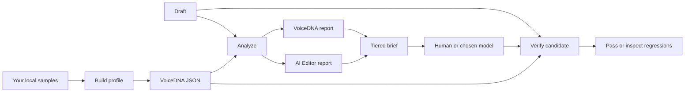

# Hold Your Voice

[](https://www.npmjs.com/package/@holdyourvoice/hyv)


Hold Your Voice is an MIT-licensed, local-first writing gate for people who want AI help without losing the parts of their writing that make it theirs.

It checks a draft through two separate programs:

- **VoiceDNA** compares the draft with 13 observable elements from your own local writing samples.
- **AI Editor** flags a reviewed, versioned set of editorial patterns that can make writing generic, formulaic, or inflated.

Those programs keep separate findings, scores, and pass states. A strong result from one never cancels a failure in the other. The tool creates a tiered editing brief, then checks the candidate again before you accept it.

Everything in the CLI runs from local files: accounts, API calls, telemetry, payment collection, and runtime network requests stay out of the core path. The optional Claude extension adds a local stdio MCP adapter around that same engine; it is not a hosted service.

> **Status:** the public CLI is published as [`@holdyourvoice/hyv`](https://www.npmjs.com/package/@holdyourvoice/hyv). It runs locally and makes no runtime network requests.

## Why it exists

A draft can avoid obvious AI-shaped writing and still sound unlike its author. It can also match a writer’s short sentences while leaning on empty persuasion templates. Those are different problems. Treating them as one generic score hides the useful signal.

Hold Your Voice keeps the work visible:

| Question | Program | Result |
| --- | --- | --- |
| Does the draft still resemble this writer’s observable mechanics? | VoiceDNA | A profile-based score, findings, and pass state. |
| Does the draft contain a configured editorial pattern worth inspecting? | AI Editor | A rule-based score, sentence findings, and pass state. |
| Did the rewrite introduce a new blocker or replace too much? | Verification | Regressions, preservation score, and a release decision. |

Its scope is a local writing gate. Authorship detection, fact checking, plagiarism review, and hosted generation each need their own tools. Hold Your Voice gives a writer or chosen model a narrow editing brief, then asks the same two engines to inspect the result.

## Start here

### Requirements

- Node.js 20 or newer.
- npm.
- At least two local writing samples you have the right to use.

### Install and verify

```bash
npx @holdyourvoice/hyv patterns
```

Run any command without a global install with `npx @holdyourvoice/hyv`. To use the short `hyv` command repeatedly:

```bash
npm install --global @holdyourvoice/hyv
hyv patterns
```

To contribute, clone this repository, run `npm install`, then run `npm test` and `npm run check:release`.

### Use it in Claude Desktop

Build the fully local Claude Desktop extension with `npm run pack:claude`, then install `dist/hold-your-voice.mcpb` from **Settings → Extensions → Advanced settings → Install Extension**. The extension accepts text and portable profile JSON in the current conversation only. A successful verification records resolved finding IDs in local learning state; it never retains writing text or makes network requests. See the [Claude Desktop guide](docs/CLAUDE-DESKTOP.md).

### Build a local VoiceDNA profile

```bash
npx @holdyourvoice/hyv profile profile.json samples/one.md samples/two.md --avoid=overused-phrase
```

Use writing by one person, with a similar audience and format where possible. The command needs at least two samples. It creates a portable JSON profile and keeps the samples on your machine. Repeat `--avoid=phrase` for each local phrase that must block a candidate.

### Inspect a draft

```bash
npx @holdyourvoice/hyv analyze draft.md profile.json
```

The result is JSON with independent reports:

```json
{
  "voiceDna": { "score": 93, "passed": true, "findings": [] },
  "aiEditor": { "score": 88, "passed": true, "findings": [] },
  "hygiene": { "suspiciousCount": 0, "fixableCount": 0, "hits": [] },
  "passed": true
}
```

Read both scored reports and the separate hygiene inspection. The outer `passed` field means each engine passed. Unicode hygiene never changes either score or the release decision.

### Inspect and clean hidden Unicode

Use the profile-free hygiene command to inspect zero-width characters, bidirectional controls, Unicode tag characters, and unusual spaces:

```bash
hyv hygiene draft.md
```

Add `--fix` to create `draft.cleaned.md` while keeping `draft.md` unchanged:

```bash
hyv hygiene draft.md --fix
hyv hygiene draft.md --fix --output=review-copy.md
```

The fix receipt lists every changed UTF-16 offset and code point. The conservative cleaner removes only a leading U+FEFF byte-order mark. It reports other zero-width characters, unusual spaces, bidirectional controls, and tag characters without changing them because they can carry legitimate language, typography, or emoji behavior. Existing output files are never overwritten.

### Add contextual editorial guidance

Use an optional local WritingBrief when the same writer needs different guidance for a social post, deck, outreach note, blog, audit, or website. A brief activates only the relevant advisory format checks and can block explicitly prohibited local terms. It never changes your VoiceDNA profile or the default two-engine analysis.

```json
{
  "version": "1",
  "audience": "technical founders",
  "intent": "start a useful discussion",
  "format": "social",
  "readerKnowsAuthor": false,
  "vocabulary": ["deployment", "incident"],
  "prohibitedTerms": ["internal contract value"],
  "evidenceStatus": "attributed",
  "argumentMap": {
    "observation": "A worker fails during a live request.",
    "mechanism": "Its in-memory state is lost.",
    "consequence": "The request restarts instead of resuming.",
    "readerValue": "Avoid the cost of a cold restart."
  }
}
```

```bash
hyv analyze draft.md profile.json writing-brief.json
hyv rewrite-prompt draft.md profile.json writing-brief.json > rewrite-brief.md
hyv verify original.md candidate.md profile.json writing-brief.json
```

Format checks, an `unverified` evidence state, and a missing configured reader-value cue are yellow review cues. `argumentMap` is a soft editorial contract surfaced to the rewrite prompt; it does not become a universal formula. Explicit `prohibitedTerms` are red release blockers. Keep client-specific briefs outside public repositories unless you have the right to publish them.

### Inspect a batch

Use batch analysis to catch exact repeated opening or closing sentences across two or more drafts. It is advisory and keeps all drafts local.

```bash
hyv batch-analyze posts/one.md posts/two.md posts/three.md
```

### Create an editing brief

```bash
npx @holdyourvoice/hyv rewrite-prompt draft.md profile.json > rewrite-brief.md
```

Give the brief and draft to a human editor or any model you trust. This repository stays out of that provider call. Ask for replacement sentences keyed by sentence number, then save the output as a separate candidate file.

### Verify the candidate

```bash
npx @holdyourvoice/hyv verify draft.md candidate.md profile.json
```

`verify` returns the original and candidate reports, identifies newly introduced findings, calculates a coarse preservation score, and exits with status `2` when the candidate fails the dual gate. A passing verification automatically records only the resolved finding IDs for that profile in local learning state. It exits with `1` for a usage or runtime error. Treat status `2` as a release signal in scripts or CI.

### Lock factual claims with a CopySpec

Use `verify-spec` when a draft has claims that must remain verbatim unless they declare atomic facts. A local CopySpec records each immutable claim alongside its evidence, then blocks a candidate if its required text or atoms are absent, or if it is joined by a prohibited claim.

```json
{
  "version": "1",
  "audience": "operators",
  "intent": "explain a launch date",
  "channel": "email",
  "claims": [
    {
      "id": "launch-date",
      "text": "The launch is on 14 August.",
      "atoms": ["The launch is on 14 August."],
      "evidence": "Release calendar, checked 7 August."
    }
  ],
  "prohibitedClaims": ["The launch is guaranteed to double revenue."]
}
```

```bash
hyv verify-spec original.md candidate.md profile.json copy-spec.json
```

The check is deterministic. Without `atoms`, an immutable claim remains a verbatim sentence check. With `atoms`, every declared phrase must remain somewhere in the candidate, allowing independent facts to be split or reordered. Atoms are lexical-presence checks, not factual validation: put the whole relationship in one atom when it must stay true (for example, `Kimi K2.6 uses INT4 weights` rather than `INT4`). It covers declared claims and prohibited text; arbitrary unsupported assertions need a separate factual evaluator.

### Local voice memory

Learning is on by default. After a successful `verify`, Hold Your Voice records resolved rule IDs under `~/.hyv/learning/`, scoped to a fingerprint of the portable profile. It stores no draft or candidate text. The next `rewrite-prompt` uses a bounded list of those verified repairs.

```bash
hyv learning show profile.json
hyv learning add profile.json "Keep the direct opening."
hyv learning clear profile.json
```

`show` lets you inspect the exact local preferences. `clear` removes only that profile's learning file. Set `HYV_HOME` to place this local state elsewhere.

## The editing loop



The tool never applies changes to your draft. You decide which findings are valid, apply replacement sentences deliberately, and run the final check.

## The five rewrite tiers

The prompt has an order. Lower tiers can refine a higher tier; they cannot override it.

1. **Tier 0: preservation.** Keep facts, names, numbers, claims, and every unflagged sentence exactly. Keep the response within the supplied sentences.
2. **Tier 1: release blockers.** Resolve profile avoid-list phrases and red findings.
3. **Tier 2: VoiceDNA.** Use the 13 profile elements as a writer-specific target.
4. **Tier 3: AI Editor.** Inspect yellow findings. Change a line only when the repair helps.
5. **Tier 4: output.** Return replacement sentences keyed by sentence number.

This order protects meaning before style. Read the complete [prompt contract](docs/PROMPT-CONTRACT.md) before changing it.

## VoiceDNA: 13 observable elements

VoiceDNA is a local profile of writing mechanics drawn from the samples you choose. It makes no claim about personality. Its structural measurements support Unicode writing; the current point-of-view and transition lists are English-specific evidence.

| # | Element | What it captures | Current gate behavior |
| --- | --- | --- | --- |
| 1 | Sentence length | Mean words per sentence | Yellow finding outside the profile band. |
| 2 | Sentence variation | Spread of sentence lengths | Used to set the sentence-length tolerance. |
| 3 | Sentence structure | Frequent three-word openings | Profile evidence. |
| 4 | Rhythm | Change between neighbouring sentence lengths | Profile evidence. |
| 5 | Paragraph length | Mean sentences per paragraph | Profile evidence. |
| 6 | Opening moves | Frequent first words | Profile evidence. |
| 7 | Vocabulary | Frequent non-stop words | Profile evidence and rewrite context. |
| 8 | Lexical density | Share of non-stop words | Profile evidence. |
| 9 | Point of view | First, second, third, or mixed | Yellow finding for a dominant-profile mismatch. |
| 10 | Punctuation | Counts of selected marks | Profile evidence. |
| 11 | Case style | Lowercase, standard, or mixed | Yellow finding on mismatch. |
| 12 | Question rate | Sentences ending in questions | Yellow finding for a material difference. |
| 13 | Transitions | Frequent recognised connectors | Profile evidence and rewrite context. |

An explicit profile avoid list creates red findings. The other evidence-only elements are calculated and shown. Future enforcement needs a written policy, counterexamples, and tests.

Read the full [VoiceDNA reference](docs/VOICE-DNA.md) and [Wiki guide](https://github.com/shashank-sn/holdyourvoice/wiki/VoiceDNA).

## AI Editor: inspectable rules

AI Editor uses a local, deterministic ruleset. The current `2.9.24-static.2` ruleset restores the reviewed 143-rule static catalog from the published `@holdyourvoice/hyv@2.9.24` `signals.ts` artifact and retains two detectors introduced in 3.1, for 145 rules total. Most rules inspect sentences; selected inherited rules inspect one physical line to preserve multi-sentence and line-start behavior. Each rule has a stable ID, severity, reason, repair direction, reconstructable expression, and explicit scope. Intentional inherited overlaps remain visible as separate findings.

Run this command to see the rules and ruleset version that actually execute in the published CLI:

```bash
npx @holdyourvoice/hyv patterns
```

From a built source checkout, run `node dist/cli.js patterns` instead.

Red findings are release blockers. Yellow findings are a request to inspect a sentence in context. A match never proves who wrote the text, and a clean scan never proves the text is good.

The repository also includes a public [220-pattern editorial catalog](docs/patterns/AI-WRITING-PATTERNS-1-220.md). It is broader editorial guidance, not a claim that all 220 entries execute. A catalog entry becomes executable only after the project has defined its counterexamples, reviewed public provenance, written tests, and decided the rule is narrow enough to help without creating noise. Neither the executable rules nor the editorial catalog can prove authorship.

## Verification contract

Verification analyzes the original and candidate with the same profile and ruleset. It passes only when:

- VoiceDNA passes.
- AI Editor passes.
- The candidate introduces zero new red findings.
- The lexical preservation score is at least 70.

The preservation score is a guardrail based on retained original words longer than four characters. A human still needs to review facts, source links, intent, and reader value.

## Commands

| Command | Input | Output | Use it when |
| --- | --- | --- | --- |
| `hyv profile <profile.json> <sample...>` | Two or more text files | Profile JSON | You need a new local reference. |
| `hyv analyze <draft> <profile.json>` | Draft and profile | Analysis JSON | You need both reports before editing. |
| `hyv hygiene <draft> [--fix] [--output=path]` | Draft | Hygiene report or cleaned copy plus receipt | You need to inspect or conservatively clean hidden Unicode. |
| `hyv rewrite-prompt <draft> <profile.json>` | Draft and profile | Markdown editing brief | You need a constrained request for an editor or model. |
| `hyv verify <original> <candidate> <profile.json>` | Original, candidate, profile | Verification JSON and exit code | You need the candidate gate. |
| `hyv verify-spec <original> <candidate> <profile.json> <copy-spec.json>` | Original, candidate, profile, CopySpec | Verification JSON with hard claim gate | A brief contains locked facts or prohibited claims. |
| `hyv learning <show\|add\|clear> <profile.json>` | Profile and optional instruction | Local learning JSON | You need to inspect or manage profile-scoped learning. |
| `hyv patterns` | None | Ruleset JSON | You need the exact enabled rules. |

Every file argument can be `-` when the command accepts text input from standard input. Profile output is always written to the path you give it. Use `npx @holdyourvoice/hyv <command>` in place of `hyv <command>` when you have not installed the CLI globally.

## Project map

| Path | Responsibility |
| --- | --- |
| `src/contracts.ts` | Profiles, findings, reports, analysis, and verification data shapes. |
| `src/text.ts` | Sentence, paragraph, word, and basic statistics helpers. |
| `src/hygiene.ts` | Profile-free hidden Unicode inspection and conservative cleaning. |
| `src/voice-dna.ts` | Builds profiles and runs VoiceDNA checks. |
| `src/ai-editor.ts` | Owns the versioned deterministic editorial rules. |
| `src/editorial-packs.ts` | Parses WritingBrief context and runs format and batch checks. |
| `src/learning.ts` | Stores text-free, profile-scoped verified repairs and composes bounded local preferences. |
| `src/pipeline.ts` | Combines pass states, makes briefs, and verifies candidates. |
| `src/cli.ts` | Local file and standard-input command adapter. |
| `src/pipeline.test.ts` | Contract and regression tests. |
| `CONTRIBUTING.md` | Public-safety rules and the contributor model. |
| `scripts/release-audit.mjs` | Checks source files for credential and network markers. |

`pipeline.ts` is the sole composition point. It combines pass states and preserves each engine’s separate score.

## Privacy and data rights

The runtime uses files on your machine. Samples, drafts, profiles, candidates, and client data stay there. Successful verification writes a text-free local learning event under `~/.hyv/learning/`: profile fingerprint, finding IDs, severities, counts, timestamp, and an opaque one-way candidate digest for retry deduplication. An instruction added through `hyv learning add` is stored as entered.

The package does not upload writing, use embeddings, or make runtime network requests. Keep writing samples, edit histories, client text, local learning files, and datasets out of public commits unless you hold explicit rights and a provenance record. A profile is aggregated JSON and can still reveal vocabulary and preferences. Store private profiles outside public repositories.

See the [privacy guide](https://github.com/shashank-sn/holdyourvoice/wiki/Privacy-and-Data-Rights) for maintainer and contributor boundaries.

## Benchmarks and claims

The repository preserves historical product material in [docs/BENCHMARKS.md](docs/BENCHMARKS.md), with related public articles about the [Voice Memory Composer](https://holdyourvoice.com/blog/voice-memory-composer) and [Hold Your Voice vs GPT-5.6 writing](https://holdyourvoice.com/blog/hold-your-voice-vs-gpt-5-6-writing).

Treat those as dated reference material. A reproducible benchmark needs rights-cleared data, frozen settings, a published rubric, separate dimensions, and visible limitations. The [benchmark guide](https://github.com/shashank-sn/holdyourvoice/wiki/Benchmarks-and-Research) explains the standard.

## Documentation

| Read this | When you need |
| --- | --- |
| [The complete Wiki](https://github.com/shashank-sn/holdyourvoice/wiki) | Product, workflow, and contributor documentation. |
| [Thesis](docs/THESIS.md) | The design argument for two independent engines. |
| [Architecture](docs/ARCHITECTURE.md) | Source boundaries and extension rules. |
| [Local voice memory](docs/wiki/Local-Voice-Memory.md) | What default local learning stores, uses, and never changes. |
| [Prompt contract](docs/PROMPT-CONTRACT.md) | The tier order and editing constraints. |
| [Pattern taxonomy](docs/PATTERN-TAXONOMY.md) | The catalog/executable-rule boundary. |
| [Support](SUPPORT.md) | Funding without a feature gate. |

## Contribute

```bash
npm test
npm run check:release
```

Read [CONTRIBUTING.md](CONTRIBUTING.md) before opening a pull request. Keep changes narrow. Add tests when code behavior changes. Separate current executable behavior, editorial guidance, historical research, and proposals. Keep private, client, secret, and unlicensed material out of issues, fixtures, tests, and documentation.

## npm releases

`@holdyourvoice/hyv` is published automatically after a change to the package source reaches `main`. The workflow publishes only when the version in `package.json` is not already on npm, so bump that version in the same pull request as a release-worthy change. It runs the tests and release audit before publishing, then verifies that npm reports the package as MIT licensed.

## Support

Hold Your Voice stays fully open source. Read the [funding policy](FUNDING.md) or [sponsor maintenance on GitHub](https://github.com/sponsors/shashank-sn) with a one-time or recurring sponsorship. Sponsorship funds maintenance while the feature set and local privacy contract remain the same for everyone.

## License

[MIT](LICENSE). You can use, modify, and distribute the code under its terms. Third-party writing and data retain their own rights.
