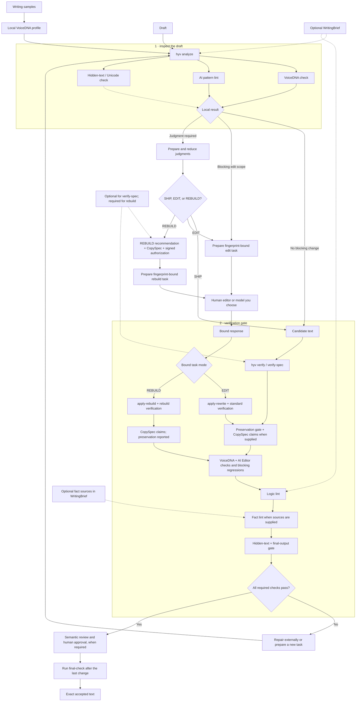

# architecture

cli commands and mcp tools call the same local engine. start in `src/cli.ts` for command dispatch, `src/mcp-server.ts` for mcp tools, or `src/pipeline.ts` for analysis and verification. paths below are relative to `src/`.

## entry points

| module | owns |
| --- | --- |
| `cli.ts` | command dispatch and exit handling. |
| `cli/checks.ts` | analysis, verification, fact and logic lint, hidden-text and delivery checks. |
| `cli/profiles.ts` | profile creation, composition, scoring, watching, evaluation, ingestion, and team profiles. |
| `cli/rewriting.ts` | edit, judgment, and rebuild commands. |
| `cli/lifecycle.ts` | semantic review, final approval, and learning commands. |
| `cli/agents.ts` | portable agent contracts. |
| `cli/io.ts` | shared file, json, profile, brief, and capability input/output. |
| `mcp.ts` | stdio startup only. |
| `mcp-server.ts` | constructs the server and registers writing, learning, and lifecycle tools. |
| `mcp-tools.ts` | adapts json arguments to the same core functions used by the cli. |
| `lifecycle-adapter.ts` | the shared core-to-cli/mcp boundary for lifecycle operations. |

## analysis and verification

`analysis.ts` combines scored output. `pipeline.ts` coordinates candidate verification and re-exports the existing analysis entry points. it combines pass states, keeps both engine scores unchanged, and attaches hygiene as a separate report that does not affect scores.

standard and rebuild verification share voicedna and ai editor checks, blocking-regression rejection, logic lint, required-fact checks, and final-output checking. fact lint runs when a `WritingBrief` supplies sources. deterministic verification artifacts share one projection. standard verification enforces preservation; `verify-spec` adds `CopySpec` claim checks. authorized rebuild verification checks `CopySpec` claims and reports preservation without using the standard preservation threshold.

| module | owns |
| --- | --- |
| `text.ts` | stable sentence indices and text measurements. |
| `voice-dna.ts` | version 2 profile building, evaluation of both profile versions, and version 3 fingerprint drift. |
| `ai-editor-rules.ts` | the stable deterministic rule catalog. |
| `rule-allowances.ts` | non-verbatim evidence for narrow profile v3 stylistic exceptions. |
| `ai-editor.ts` | markdown non-prose masking with preserved offsets; sentence, physical-line, and document rules under ruleset `3.5.0-local.4`; policy application without changing rule ids. |
| `fact-linter.ts` | source-grounded claim extraction and deterministic evidence checks. known conflicts are errors; unclear evidence requires human review. |
| `hygiene.ts` | hidden unicode inspection and conservative, explicit cleaning without scoring the writing. |
| `profile-quality.ts` | advisory sample readiness checks without changing profile bytes. |
| `delivery-integrity.ts` | an opt-in offline output check, separate from hidden-unicode `final-check`. |
| `disposition.ts` | mapping existing reports to `block`, `review`, and `signal` without changing legacy fields. |
| `team-profile.ts` | consent-bound, digest-locked membership bundles containing fingerprints rather than samples. |

`finalOutputCheck` in `hygiene.ts` is the profile-free final boundary shared by cli and mcp. clean text passes byte-for-byte, a leading `U+FEFF` is removed, and unresolved hidden unicode withholds output.

## edit scope and approval

`analysis.ts` derives edit eligibility from structured blocking findings. advisory and pending-judgment findings cannot grant edit scope. rewrite preparation stays limited to flagged sentence ids and preserves clean, unflagged text.

| module | owns |
| --- | --- |
| `analysis.ts` | combines engines and derives strict findings and edit scope. |
| `rewrite-prompt.ts` | renders the editing contract from an analysis; optional editorial context has one explicit section. |
| `rewrite-task.ts` | versioned sentence-replacement and range-edit tasks. |
| `rewrite-response.ts` | response json size checks and parsing, failure records, and lifecycle bindings shared by edit and rebuild tasks. |
| `judgment-task.ts` | reducing pre-edit `SHIP`/`EDIT`/`REBUILD` recommendations and post-candidate clearance. |
| `rebuild-task.ts` | whole-document rebuild tasks, requiring an upstream `REBUILD` recommendation, a `CopySpec`, and a signed `hyv.rebuild-authorization` capability. |
| `semantic-review.ts` | reducing immutable semantic and human-review lifecycle artifacts. |
| `approval-capability.ts` | canonical ed25519 capability verification. |
| `approval-context.ts` | permission-checked trust roots and evaluator authorization. |

## learning and local boundaries

verification is read-only. `rewrite-prompt` reads only explicit or separately approved learning. `learning.ts` stores text-free events scoped to a stable profile and composes at most ten local preferences. learning is deterministic and inspectable with `hyv learning show`.

profile v3 history uses a stable local identity. revision compatibility and authority decide which events become active guidance. learning never stores draft or candidate text, calls a model, or synchronizes.

the restored catalog stays local. the engine did not inherit 2.9 hosted analysis, telemetry, authentication, profile sync, provider calls, automatic draft mutation, or whole-draft rewriting. a human editor or model you choose supplies edits and judgments.

commands write files only through named output or learning operations. `hyv hygiene --fix` refuses to overwrite its input or an existing output. lifecycle capabilities are accepted only through stdin or a permission-checked file.

## writing workflow



run `final-check` again after the last human, model, formatter, or template change. hyv never calls a model; a human editor or model you choose supplies edits and judgments.

## compatibility and source ownership

the public module paths remain available. `pipeline.ts` re-exports moved analysis and prompt functions so existing imports continue to work. data contracts in `contracts.ts`, rule ids, prompt text, canonical bytes, and profile schemas remain stable. the version bump changes version-bound verification fingerprints; create fresh tasks and approvals after upgrading.

the rewrite keeps functions that already express a single operation clearly. cryptographic validation, lock ownership, canonical encodings, rules, fixtures, and historical benchmark identities are preserved rather than replaced for appearance. changes concentrate on repeated work, mixed responsibilities, and opaque control flow. there is no service container, plugin dispatch framework, runtime schema generator, or model client.

use a separately built baseline to compare behavior:

```bash
npm run check:compatibility -- /path/to/built-baseline . /tmp/hyv-compatibility.json
```

the check exercises existing exports, serialized function results, errors, cli output and exit codes, and mcp schemas in both sensitive-input modes. it rejects missing functions and records the compiled input hashes. when package versions differ, it copies the baseline into a temporary directory and changes only its literal `dist/version.js` export to the candidate version. the receipt records both versions and module hashes. it compares output fields and fingerprints exactly; it never edits the source baseline or normalizes result hashes. stateful learning, signed approval, ingestion, and watcher behavior also have focused tests. every baseline test stays in the repository; compiled test files are excluded from the npm package.

## extending the engine

add an ai editor rule in `ai-editor-rules.ts` with positive and negative tests and a documentation entry. add a voicedna signal in `voice-dna.ts` with an auditable explanation. the [prompt contract](PROMPT-CONTRACT.md) owns tier ordering; changing the priority above preservation requires a contract and test update.
