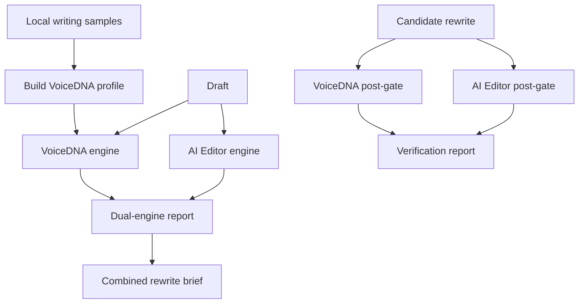

# feat: publish the local Hold Your Voice engine

## Summary

Build `holdyourvoice` as an MIT-licensed, local-first TypeScript CLI for analyzing and improving drafts. A draft must pass two independently scored engines—VoiceDNA and AI Editor—before a combined rewrite brief is produced; a candidate rewrite must then pass both engines again.

---

## Problem Frame

The source application is a production system containing hosted APIs, MCP, billing, infrastructure, analytics, deployment code, and user-derived data paths alongside reusable local writing logic. Publishing it wholesale would create privacy, security, and maintenance risk. The public repository needs a self-contained implementation whose behavior, data provenance, and quality gates can be understood and reproduced without accessing a hosted service.

---

## Requirements

### Local product contract

- R1. The repository runs without an API, MCP server, account, telemetry, or network request.
- R2. `analyze` runs VoiceDNA and AI Editor independently and returns both scores, their findings, and a combined status.
- R3. VoiceDNA builds a portable profile only from user-supplied local samples and evaluates cadence, vocabulary, openings, and explicit avoid-list rules.
- R4. AI Editor evaluates a versioned, public pattern taxonomy and reports sentence-addressable findings with rationale and repair guidance.
- R5. `rewrite-prompt` creates a bounded combined brief from both engines, preserving the original draft and targeting only flagged sentences.
- R6. `verify` re-runs both engines on a candidate rewrite, detects newly introduced problems, and refuses a pass when either required gate fails.

### Public-release contract

- R7. All shipped code and authored documentation are MIT-licensed; third-party or user-derived content is excluded unless it has an explicit public provenance record.
- R8. The repository documents its engine boundaries, scoring limitations, prompt construction, sentence-level gate, data model, extension points, and reproducible evaluation approach.
- R9. The historical GPT-5.6 pilot is described as a public, non-reproducible historical result until its source tasks, candidates, reviewer records, settings, and usage rights are curated into a versioned public benchmark.
- R10. Tests cover each engine, score isolation, merged prompt inputs, rewrite regression detection, CLI JSON contract, and no-network/no-telemetry behavior.

---

## Key Technical Decisions

- KTD1. **Fresh repository history:** copy only reviewed public source into the new repository. The original history contains operational and secret-adjacent material, so removing files from a mirrored history is insufficient.
- KTD2. **Two scores, no opaque mega-score:** VoiceDNA and AI Editor expose their own score and pass state. A combined status is a policy decision, not an additional quality metric that hides a failing engine.
- KTD3. **Profile data stays local:** user samples generate a JSON profile on the user’s machine. Fixtures are synthetic or author-owned and include provenance.
- KTD4. **Deterministic core; bring-your-own writer:** the project produces a structured rewrite brief but does not call a model. This preserves local-only behavior and lets users choose their own LLM.
- KTD5. **Sentence-first reporting:** every finding includes a sentence index and text span where applicable. Rewrite verification compares the candidate with the baseline to surface regressions rather than trusting a single scan.
- KTD6. **Public benchmark discipline:** checked-in eval records identify data source, license, engine version, and rubric. Marketing claims never substitute for source cases and results.

---

## High-Level Technical Design

The engines share text segmentation only. They do not share scores, rule weights, or pass criteria. The merge layer passes both evidence sets into the rewrite brief and the post-gate policy.

---

## Scope Boundaries

### Included

- Local CLI, deterministic engines, profile format, public rule taxonomy, synthetic fixtures, docs, benchmark schema, and CI.

### Deferred for later

- Optional adapters that submit the generated rewrite brief to a user-selected model.
- A reproducible public replacement for the historical GPT-5.6 pilot once the underlying artifacts and rights are curated.

### Outside this product's identity

- Hosted API, MCP, auth, billing, analytics, production databases, cloud deployment, customer workspaces, user feedback history, embeddings, and secret-backed automation.

---

## Implementation Units

### U1. Create the public package boundary

- **Goal:** Establish the Node/TypeScript package, MIT licensing, contributor safety rules, and offline test/build tooling.
- **Requirements:** R1, R7, R10.
- **Dependencies:** None.
- **Files:** `package.json`, `tsconfig.json`, `.gitignore`, `LICENSE`, `CONTRIBUTING.md`, `.github/workflows/ci.yml`.
- **Approach:** Keep dependencies minimal. CI runs build, tests, and a release audit that rejects secrets, network clients, and forbidden hosted-product terms.
- **Test scenarios:** A clean install builds and runs tests; the audit fails on a committed `.env` or API URL; the package declares MIT.
- **Verification:** A clean clone passes CI without credentials.

### U2. Define portable data contracts and text segmentation

- **Goal:** Make profile, finding, score, analysis, rewrite-brief, and verification contracts stable and machine-readable.
- **Requirements:** R2-R6, R10.
- **Dependencies:** U1.
- **Files:** `src/contracts.ts`, `src/text.ts`, `src/text.test.ts`.
- **Approach:** Give each sentence a stable one-based index and character range; use explicit engine-version fields.
- **Test scenarios:** Markdown paragraphs, headings, punctuation, quotes, and blank lines preserve stable sentence references; malformed input returns a clear validation error.
- **Verification:** Every CLI response serializes the declared contracts.

### U3. Build VoiceDNA profile and evaluator

- **Goal:** Derive an inspectable profile from local samples and score a draft against it.
- **Requirements:** R2, R3, R10.
- **Dependencies:** U2.
- **Files:** `src/voice-dna.ts`, `src/voice-dna.test.ts`, `fixtures/voice/`.
- **Approach:** Measure sentence-length distribution, paragraph shape, opening tendencies, lexical preference, and explicit avoid-list hits. Explain each deviation rather than claiming identity detection.
- **Test scenarios:** Same-style fixture scores higher than deliberate cadence/vocabulary drift; avoid-list hits are sentence-addressable; insufficient samples fail without writing a partial profile.
- **Verification:** Profile generation is deterministic and does not retain raw samples outside the caller’s chosen output file.

### U4. Build the AI Editor taxonomy and evaluator

- **Goal:** Publish a versioned, explainable collection of AI-writing patterns with per-sentence findings and an independent score.
- **Requirements:** R2, R4, R10.
- **Dependencies:** U2.
- **Files:** `src/ai-editor.ts`, `src/patterns.ts`, `src/ai-editor.test.ts`, `docs/patterns/`.
- **Approach:** Start from reviewed generic patterns only; preserve category, severity, reason, suggestion, and pattern version. Do not copy user-specific rules or examples.
- **Test scenarios:** Known fixture triggers the expected rule and span; allowed counterexample does not trigger; score changes only from editor findings.
- **Verification:** The exported rule list and documentation have matching IDs and counts.

### U5. Compose the dual-engine rewrite and post-rewrite gate

- **Goal:** Turn separate analyses into a bounded rewrite brief and verify a candidate against the original baseline.
- **Requirements:** R2, R5, R6, R10.
- **Dependencies:** U3, U4.
- **Files:** `src/rewrite.ts`, `src/verify.ts`, `src/rewrite.test.ts`, `src/verify.test.ts`.
- **Approach:** Include profile constraints and editor findings separately, identify sentences eligible for change, require factual preservation, and report newly introduced findings by engine.
- **Test scenarios:** Prompt includes both scorecards without conflating them; clean sentences are marked preserve; a candidate with a new AI pattern fails even if VoiceDNA improves; a candidate with VoiceDNA drift fails even if AI Editor passes.
- **Verification:** A verification response names the failing engine and sentence-level evidence.

### U6. Expose the local-first CLI and examples

- **Goal:** Provide `profile`, `analyze`, `rewrite-prompt`, `verify`, and `patterns` commands with text and JSON output.
- **Requirements:** R1-R6, R10.
- **Dependencies:** U3-U5.
- **Files:** `src/cli.ts`, `src/cli.test.ts`, `examples/`.
- **Approach:** Read files or stdin only; write only to explicit user paths; return non-zero on a failed verify gate.
- **Test scenarios:** Each command accepts stdin; JSON exposes both engine results; no command attempts a network connection; failed verify returns the documented exit code.
- **Verification:** Examples execute unchanged in CI.

### U7. Publish the thesis, README, and benchmark contract

- **Goal:** Make the system reproducible and honest about what is public evidence versus historical product reporting.
- **Requirements:** R7-R10.
- **Dependencies:** U1-U6.
- **Files:** `README.md`, `docs/THESIS.md`, `docs/ARCHITECTURE.md`, `docs/PATTERN-TAXONOMY.md`, `docs/VOICE-DNA.md`, `docs/BENCHMARKS.md`, `evals/README.md`, `evals/schema.json`, `evals/fixtures/`.
- **Approach:** Explain why the engines are separate, how profiles are derived, how rules are evaluated, how the mega prompt is assembled, how post-gating works, and how to run a fair blind comparison. Preserve the GPT-5.6 article’s published pilot methodology as a clearly labelled historical report, without claiming reproducibility before raw artifacts exist.
- **Test scenarios:** Documentation links resolve; every public fixture has provenance; the benchmark schema validates a synthetic case; README command examples stay in sync with CLI tests.
- **Verification:** A new contributor can build a profile, analyze a draft, generate a rewrite brief, and verify a candidate using only the repository.

---

## Risks and Mitigations

| Risk | Mitigation |
| --- | --- |
| Historical repository data may contain secrets or client-derived material | Fresh history, allowlisted migration, secret scan, provenance review, and no source database exports. |
| The 220+ taxonomy may include proprietary examples | Publish generic rule definitions and synthetic counterexamples only; require a provenance field for every fixture. |
| A combined score could mask a bad rewrite | Preserve independent scorecards and make verify fail on either required engine. |
| Historical benchmark claims cannot be independently rerun | Label them as historical; publish no leaderboard until source artifacts and reviewer protocol are released. |

---

## Documentation and Evaluation Notes

The local source contains a public article describing a 16-pair GPT-5.6 pilot: 29 of 32 blind reviewer decisions preferred the profile-aware edit. The released repository may cite this as a historical product report with its source URL and methodology, but must not package it as a reproducible benchmark until source tasks, baseline/candidate outputs, model settings, randomized review records, and licensing provenance are present.

## Sources and Research

- `cli/src/lib/pipeline.ts` and `cli/src/lib/validator.ts` in the source application establish deterministic scan, validation, cadence, anchor, and semantic-preservation concepts.
- `hyv/voice_bible.py` and `hyv/memory.py` establish the six-part profile/voice-memory concepts, but their database and learning-history paths stay private.
- `blog/voice-memory-composer.md` documents the public rationale for query-conditioned, budget-aware memory. The public CLI uses only a user-controlled local profile.
- `blog/hold-your-voice-vs-gpt-5-6-writing.md` documents the historical pilot and its limitations.
- https://github.com/openai/evals documents public-eval practices: versioned cases, explicit metrics, and rights to released data.
