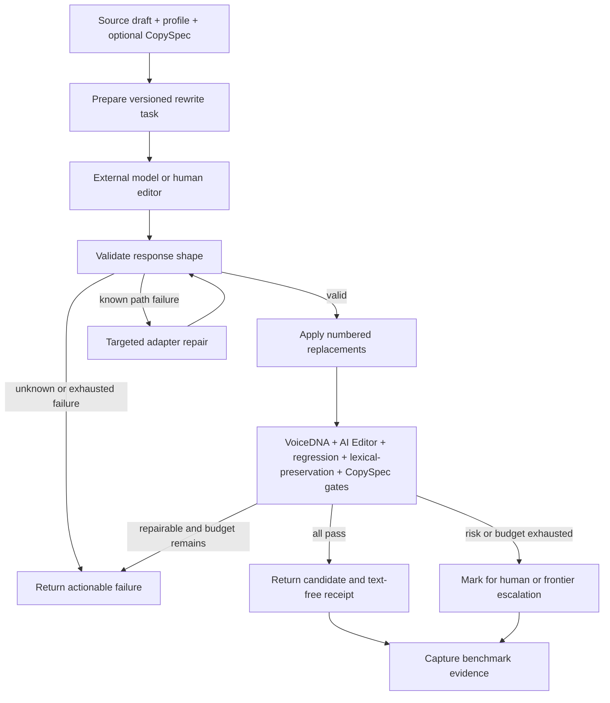

# feat: Add a rewrite-first parity harness

## Summary

Add a local, provider-neutral rewrite harness that gives a lower-tier model a constrained task packet, checks its changes, and produces reproducible evidence against a pinned frontier reference. The harness measures non-inferiority on a defined rewrite task; it does not claim general model equivalence.

---

## Problem Frame

HYV already produces a tiered rewrite brief and verifies a resulting candidate through independent VoiceDNA and AI Editor gates. The new CopySpec foundation adds exact immutable-claim and prohibited-claim checks. What is missing is the contract between that brief and an external model response, a bounded repair lifecycle, and a benchmark that can support a specific cost-and-quality decision.

The attachment describes a useful systems pattern: valid data passes unchanged; a validator identifies the exact failing path; a small ordered repair catalog handles only known recoverable shapes; failures return a model-readable explanation. The same pattern applies to a rewrite response, but not to prose itself. The harness must never silently rewrite valid text or present a private internal comparison as a general model ranking.

---

## Requirements

### Task contract and safety

- R1. HYV must create one versioned rewrite task packet containing the original draft, stable sentence map, profile, tiered brief, optional CopySpec, and output policy.
- R2. A response may change only flagged sentences through numbered replacements; duplicate, unknown, malformed, or clean-sentence replacements must fail before a candidate exists.
- R3. The response validator must run before repair. It may repair only a recorded, path-specific output-shape failure and must leave a valid response byte-for-byte unchanged.
- R4. Every candidate must pass the existing VoiceDNA, AI Editor, regression, lexical-preservation, and CopySpec gates before it can be selected or learned from.

### Evidence and evaluation

- R5. The benchmark corpus must contain only synthetic or rights-cleared rewrite packets with provenance, a profile, a CopySpec where factual claims matter, and a fixed reviewer rubric.
- R6. Every benchmark run must record model identifier and revision, provider, sampling settings, task/brief/validator versions, candidate and repair counts, latency, token use, cost, and deterministic gate results.
- R7. The evaluation must compare identical frozen packets across a pinned frontier reference, a lower-tier direct baseline, and the lower-tier harness treatment.
- R8. Blinded human review must be the primary quality decision. The primary outcome is approval without a meaningful edit; factual-error rate, voice fit, AI-editor residue, latency, escalation rate, and cost per approved draft remain separate metrics.
- R9. A promotion decision requires a pre-registered non-inferiority margin, no factual-error increase, a lower cost per approved draft, and a locked held-out test partition that thresholds cannot tune against.

### Product boundary

- R10. The public HYV runtime must remain provider-neutral, local-first, and free of provider credentials or runtime network calls.
- R11. CLI and MCP must expose the same prepare, apply, verify, and inspect capabilities over the same local artifacts.
- R12. Learning and run receipts must remain text-free. Drafts, candidates, prompts, CopySpec evidence, and provider output must not enter local learning state.

---

## High-Level Technical Design

The model receives a task contract and returns a replacement payload. HYV owns parsing, deterministic repair, application, verification, and evidence collection. A caller outside HYV owns any provider invocation or escalation.

---

## Key Technical Decisions

- KTD1. **Build a rewrite-only harness before fresh drafting.** A source draft gives every case a stable preservation target and makes factual regressions observable.
- KTD2. **Keep provider calls outside the package.** This preserves the local-first release boundary and makes the benchmark runner accept captured outputs from any approved provider.
- KTD3. **Use validate-then-repair, not universal preprocessing.** The schema localizes a failure; a repair is permitted only for a known response path and must create an audit event.
- KTD4. **Treat CopySpec as a hard but narrow factual gate.** It verifies declared immutable and prohibited text. Human review or a separately validated factual evaluator must assess unsupported paraphrases and new assertions.
- KTD5. **Use hard gates before quality comparison.** A fluent candidate with a claim failure has failed; it must not be rescued by a composite score or a model judge.
- KTD6. **Pre-register the benchmark before running the held-out suite.** Freeze the corpus partitions, model settings, reviewer rubric, meaningful-edit definition, margin, and escalation policy before results exist.
- KTD7. **Return an escalation classification, not an automatic provider route.** The package may label a candidate `accepted`, `repairable`, or `needs_escalation`; the caller retains cost and provider authority.

---

## Implementation Units

### U1. Stabilize CopySpec as the factual plane

- **Goal:** Make the existing CopySpec foundation a declared prerequisite for the harness and close its deterministic edge cases.
- **Requirements:** R4, R5, R12.
- **Dependencies:** None.
- **Files:** `src/copy-spec.ts`, `src/contracts.ts`, `src/pipeline.ts`, `src/pipeline.test.ts`, `src/cli.test.ts`.
- **Approach:** Keep immutable and prohibited claims fail-closed. Add structured failure categories and sentence-to-claim audit links without representing exact text checks as semantic factuality.
- **Patterns to follow:** Existing `verifyWithCopySpec`, `Verification`, and focused Node test patterns.
- **Test scenarios:** A mutable claim may be absent; immutable claims spanning punctuation normalize predictably; multiple claims map to one sentence; malformed or duplicate claim IDs fail before verification; a passing voice result still fails on a claim failure.
- **Verification:** CopySpec fixtures demonstrate declared-claim enforcement and preserve the existing exit-code contract.

### U2. Add a versioned rewrite task and strict replacement applicator

- **Goal:** Turn the current prose brief into a deterministic handoff and apply only authorized replacements.
- **Requirements:** R1, R2, R3, R4, R12.
- **Dependencies:** U1.
- **Files:** `src/contracts.ts`, `src/rewrite-task.ts`, `src/pipeline.ts`, `src/text.ts`, `src/rewrite-task.test.ts`, `src/pipeline.test.ts`.
- **Approach:** Define a versioned task manifest with sentence indices, eligible sentence IDs, the existing prompt contract, optional CopySpec, and bounded repair policy. Parse model responses into replacements, reject changes outside the eligible set, then apply replacements from the original text rather than accepting a full rewritten document.
- **Patterns to follow:** Stable sentence offsets in `src/text.ts`; tier ordering in `docs/PROMPT-CONTRACT.md`; parser validation in `src/profile.ts` and `src/copy-spec.ts`.
- **Test scenarios:** Valid numbered replacements preserve every clean sentence; duplicate or out-of-range sentence IDs fail; a stringified replacement list repairs only after schema rejection; a valid response bypasses all adapters; an adapter cannot alter replacement content outside its known shape fix.
- **Verification:** The same task and response yield a byte-identical candidate across repeated runs, with an audit record of any applied adapter.

### U3. Expose task lifecycle parity through CLI and MCP

- **Goal:** Let a human, script, or MCP client prepare and verify the same task without adding a model provider to HYV.
- **Requirements:** R1, R4, R10, R11, R12.
- **Dependencies:** U2.
- **Files:** `src/cli.ts`, `src/mcp-tools.ts`, `src/mcp.ts`, `src/cli.test.ts`, `src/mcp-tools.test.ts`, `src/mcp.test.ts`, `Readme.md`, `docs/PROMPT-CONTRACT.md`.
- **Approach:** Add paired prepare and apply commands/tools backed by shared pipeline functions. Keep the current human-readable rewrite prompt as a compatibility surface. Return actionable rule IDs, claim IDs, and sentence numbers when a candidate is repairable or needs escalation.
- **Patterns to follow:** Existing CLI/MCP adapter split, exact MCP tool-order coverage, and candidate-gate exit status `2`.
- **Test scenarios:** CLI and MCP serialize the same canonical task; both reject the same malformed response; a CopySpec reaches the MCP preparation path; a failed apply creates no learning event; existing commands remain compatible.
- **Verification:** Contract tests prove parity without a provider key, network request, or persisted text artifact.

### U4. Add bounded run receipts and escalation classification

- **Goal:** Make a completed task auditable without storing the writer's text or silently retrying a weak model.
- **Requirements:** R3, R4, R9, R12.
- **Dependencies:** U2, U3.
- **Files:** `src/contracts.ts`, `src/pipeline.ts`, `src/learning.ts`, `src/learning.test.ts`, `src/pipeline.test.ts`.
- **Approach:** Represent `accepted`, `repairable`, and `needs_escalation` as result states derived from deterministic failures and a one-repair default. Store only profile/task fingerprints, validator versions, failure categories, and final state after successful verification.
- **Patterns to follow:** Bounded, profile-fingerprinted, text-free learning events in `src/learning.ts`.
- **Test scenarios:** A repeated failed response never increases confidence; a repaired pass creates one receipt; claim ambiguity produces `needs_escalation`; a final pass cannot record draft, candidate, evidence, prompt, or provider text.
- **Verification:** Receipt fixtures prove deduplication, bounded storage, and no text leakage.

### U5. Build the reproducible rewrite benchmark harness

- **Goal:** Evaluate captured frontier and lower-tier outputs under identical task contracts without placing credentialed generation in the runtime package.
- **Requirements:** R5, R6, R7, R8, R9, R10.
- **Dependencies:** U1, U2, U4.
- **Files:** `benchmarks/README.md`, `benchmarks/schema/`, `benchmarks/cases/`, `benchmarks/reviews/`, `scripts/evaluate-rewrite-benchmark.mjs`, `src/benchmark.test.ts`, `docs/BENCHMARKS.md`.
- **Approach:** Define versioned task, captured-output, review, and aggregate-report manifests. Split cases by writer and topic into development, calibration, and locked-test partitions. Run existing deterministic gates for every captured output, create randomized blind labels for eligible outputs, and calculate paired quality, factuality, latency, and cost metrics separately.
- **Patterns to follow:** Provenance and reproducibility requirements already stated in `docs/BENCHMARKS.md`; release audit boundary in `scripts/release-audit.mjs`.
- **Test scenarios:** A report rejects missing provenance, model settings, human rating, or blind label; a case cannot appear in both calibration and locked test; a failing hard gate is excluded from preference selection but remains counted in factual metrics; results remain reproducible from fixed manifests.
- **Verification:** A synthetic fixture corpus produces a complete report, while missing evidence prevents a parity conclusion.

### U6. Publish a promotion rule and limitations report

- **Goal:** Make model-selection decisions repeatable and keep external claims within the observed benchmark.
- **Requirements:** R6, R8, R9, R10.
- **Dependencies:** U5.
- **Files:** `docs/BENCHMARKS.md`, `docs/wiki/Benchmarks-and-Research.md`, `Readme.md`, `benchmarks/README.md`.
- **Approach:** Document the frozen protocol, review rubric, pre-registered non-inferiority margin, promotion rule, and failure taxonomy. Report the frontier and lower-tier paths by exact model/settings and task distribution. Publish only rights-permitted artifacts.
- **Patterns to follow:** The existing distinction between historical context and reproducible evidence in `docs/BENCHMARKS.md`.
- **Test scenarios:** Documentation examples use the same manifest fields as the validator; reports without a locked-test result or factual metric cannot use a parity or superiority conclusion.
- **Verification:** A reviewer can reproduce the decision from the manifest, outputs, blind-review records, and report without access to client drafts.

---

## Benchmark Protocol

Use a fixed, rewrite-only corpus stratified across five failure classes: locked names/dates/numbers, voice mismatch and AI-editor residue, minimal-change drafts with many clean sentences, dense factual and formatting constraints, and editorial cases that require author preference.

For every packet, capture four paths with identical source material and task contract: the unedited source, the pinned frontier reference, the lower-tier direct baseline, and the lower-tier harness treatment. Provider/model identity, revision, context window, tool mode, prompt version, temperature, seed where available, token counts, price basis, and run timestamp are mandatory fields.

Blind reviewers see randomized outputs and the fixed meaningful-edit rubric, never model identity or treatment. The review form records approval without meaningful edit, pairwise preference where both candidates pass hard gates, factual errors by category, and whether an escalation would have been appropriate. Calibration chooses the escalation threshold; locked-test results only evaluate it.

---

## Promotion Rule

Promote the lower-tier harness only when all pre-registered conditions hold on the locked test partition:

1. Its approval-without-meaningful-edit result remains inside the declared non-inferiority margin against the pinned frontier path.
2. Its factual-error rate does not increase.
3. Its cost per approved draft is lower after candidate, repair, and escalation costs.
4. The report includes enough provenance to reproduce every included result.

The permitted statement is bounded: “This lower-tier harness met the declared rewrite benchmark under the recorded settings and routing policy.”

---

## Scope Boundaries

### In scope

- Rewrite-first task preparation, exact replacement application, deterministic validation, bounded repair feedback, provider-neutral evidence capture, blind review, and a promotion decision.

### Deferred to follow-up work

- Fresh-draft generation, a semantic factuality evaluator, a calibrated model-based judge, training or fine-tuning, and automatic model-provider escalation.

### Outside this product's identity

- Provider credentials, hosted client content, runtime network calls in `src/`, hidden full-text memory, and broad claims that one model is generally better than another.

---

## Risks and Dependencies

- The uncommitted CopySpec foundation in the current worktree is a prerequisite. Fold it into the first implementation change or commit it before treating this plan as a clean baseline.
- Exact CopySpec matching catches declared facts but cannot prove semantic entailment. Keep the factual-error rubric and human review mandatory.
- One repair pass controls cost and prevents retry-based score inflation, but calibration may show that some output-shape errors need a different adapter or an earlier escalation category.
- Blind author review is scarce. Start with a small rights-cleared corpus, measure reviewer agreement, and do not publish a comparison until the locked partition has enough completed ratings for the pre-registered analysis.
- Model aliases and provider behavior drift. Every report must pin the exact model/version and generation configuration; a vendor label alone is not reproducible.

---

## Sources and Research

- HYV technical harness: the linked Notion page, “Making a Lower-Tier Model Reach Frontier Copy Quality — Technical Harness.”
- Attachment: `pasted-text.txt`, which motivates validator-localized repair and transparent defaults; its internal 6/10 result is unverified outside that system.
- [OpenAI: Working with evals](https://developers.openai.com/api/docs/guides/evals) supports task-defined evaluation, running the eval, analyzing results, and iterating; the page also announces its legacy Evals platform retirement schedule, so this plan uses provider-neutral local manifests.
- [Anthropic: Tool use with Claude](https://platform.claude.com/docs/en/agents-and-tools/tool-use/overview) documents schema-bound tool inputs, tool-result loops, and strict schema conformance; this informs the response contract, not a provider dependency.
- [Google: Structured outputs](https://ai.google.dev/gemini-api/docs/structured-output) states that syntactically valid schema output still needs application-level semantic validation.
- [Self-Refine](https://arxiv.org/abs/2303.17651) supports the use of bounded, actionable feedback and selection, while also documenting that weak models may fail to follow refinement instructions.
