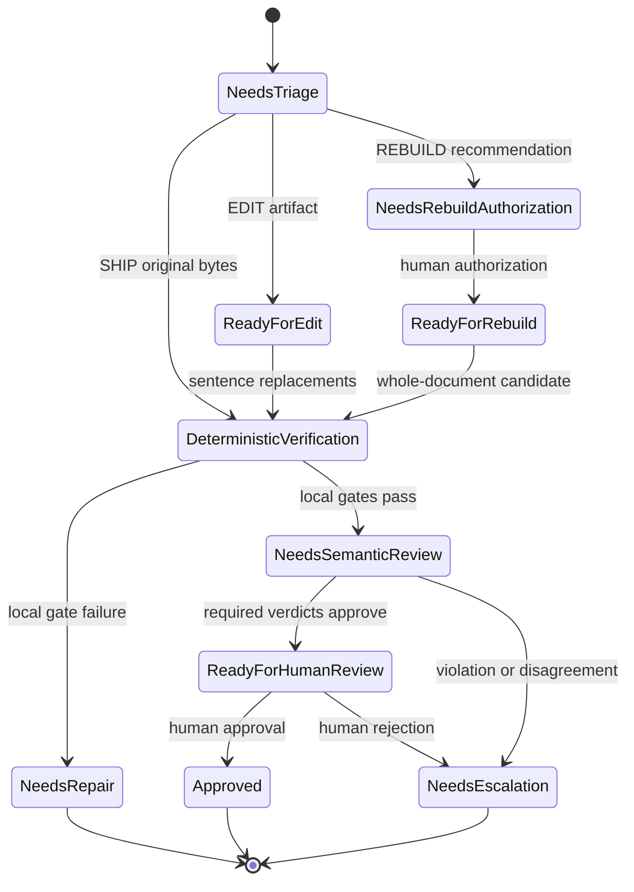

# refactor: Build a founder-aware rewrite system

## Goal Capsule

- **Objective:** Turn Hyv's current edit harness into a founder-aware writing system with defensible rule policy, structured fingerprints, a complete review lifecycle, and a separately authorized rebuild path.
- **Authority:** The supplied `hyv-next` handoff defines the desired writing behavior. Current Hyv contracts and release constraints define the implementation boundary. Where the handoff conflicts with itself, the evidence dataset and current local-first contract control.
- **Execution profile:** Characterization-first, provider-neutral, and dependency-ordered. Each public contract lands with CLI and MCP parity.
- **Stop conditions:** Stop if founder samples lack distribution rights, a proposed stage requires provider calls inside Hyv, or an implementation unit would weaken byte preservation for normal edit mode.
- **Tail ownership:** Finish with regression evidence, release-audit parity, documentation, and a human ship decision. Do not auto-publish or auto-promote rebuild output.

---

## Product Contract

### Summary

Hyv will keep its local deterministic edit engine and add founder-aware policy around it. The system will distinguish surgical editing from full rebuilding, require structured host-supplied judgments for semantic decisions, and learn only from candidates that reach terminal acceptance. Founder voice remains a measured target with tolerances, not a frozen set of verbatim lines.

### Problem Frame

The current rule catalog catches broad AI-writing patterns, but several rules also fire on the founders' published writing. Current profiles cannot express per-founder rule policy or the new fingerprint measurements. Learning is tied to a hash of the complete mutable profile, so profile edits strand history. A deterministically valid rewrite ends at `needs_semantic_review`, but CLI and MCP expose no operation that can finalize the review. The proposed rebuild path would also bypass the surgical preservation contract unless it receives a separate task, authorization, and acceptance flow.

### Requirements

**Rule and profile behavior**

- R1. Hyv must classify rule behavior per profile as blocking, advisory, judgment-required, or disabled while preserving stable rule IDs and deterministic ordering.
- R2. Every reconciled rule must retain intended positive detections and gain founder-authored counterexamples for known false positives.
- R3. A versioned founder fingerprint must represent measurable voice targets, protected facts or constructions, rule policy, provenance, and tolerance without treating example sentences as immutable bytes.
- R4. Profile version 2 must remain readable while version 3 adds stable identity, revision metadata, new VoiceDNA metrics, and fingerprint policy.

**Review and rewrite lifecycle**

- R5. Hyv must prepare versioned argument, form, triage, flatness, and semantic judgment tasks without invoking a provider or storing provider credentials.
- R6. Every submitted judgment must match its originating task fingerprint, source hash, profile identity and revision, ruleset version, schema version, judgment type, evaluator identity, and referenced sentence or evidence scope.
- R7. The rewrite lifecycle must reject stale, skipped, malformed, or out-of-order transitions, treat an exact repeated artifact idempotently, and expose the same terminal meaning through core, CLI, and MCP surfaces.
- R8. Deterministic verification, semantic clearance, and human approval must remain separate states. Accepted-candidate learning requires human approval; a human may submit separate text-free rejection feedback without approving the candidate.

**Edit and rebuild behavior**

- R9. Surgical edit mode must support bounded sentence-range replacement or deletion, preserve every ineligible sentence byte-for-byte, and keep deterministic, CopySpec, hygiene, and semantic gates active.
- R10. Rebuild mode must use a separate task and response contract, require an accepted triage artifact, a CopySpec, and a signed capability from a configured external human-approval authority, and keep factual, polarity, hygiene, fingerprint, and semantic gates active.
- R11. A caller must not be able to select `REBUILD`, lower a preservation floor, or expand edit eligibility without a fingerprint-bound upstream artifact.

**Learning, evidence, and release**

- R12. Learning must use stable local profile identity, preserve provenance and authority, support ratification, and retain higher-authority events during compaction.
- R13. Learning and receipts must remain text-free: no drafts, candidates, prompts, founder samples, evidence spans, or provider output may enter retained state.
- R14. A rights-cleared, locked regression corpus must measure rule residue, voice fit, preservation, argument quality, polarity, form compliance, flatness, and CLI/MCP parity before release.
- R15. Current final-output hygiene and release-audit guarantees must apply to every new output path.

### Acceptance Examples

- AE1. **Founder construction remains valid.** Given a profile that marks a two-beat thesis construction as advisory, when the construction appears in a clean founder sentence, then analysis reports no blocking failure and edit mode cannot change the sentence.
- AE2. **Known tell remains repairable.** Given a founder-authored sentence containing a blocking performative-sincerity rule, when analysis runs, then the finding makes only that sentence eligible and the positive fixture still fires.
- AE3. **Semantic or human rejection prevents learning.** Given a candidate that passes deterministic verification but reverses a technical claim, when semantic verdicts reject it, then the lifecycle ends in escalation and writes no learning event. Given a semantically clean candidate that a human rejects, then it records feedback but not accepted-candidate learning.
- AE4. **Rebuild cannot be self-selected.** Given a caller without an accepted triage artifact and human authorization receipt, when it submits a rebuild response or requests a zero preservation floor, then every surface rejects the operation.
- AE5. **Profile changes retain history.** Given a version 3 profile with accepted learning, when its measured fingerprint changes, then the same local profile retains its history while an unrelated profile remains isolated.
- AE6. **Adapter parity holds.** Given equivalent inputs, when core, CLI, MCP helpers, and registered MCP tools prepare or evaluate a task, then their canonical artifacts, statuses, findings, thresholds, and receipts match.

### Scope Boundaries

**In scope**

- Rule reconciliation, structured fingerprints, Profile v3 compatibility, stable learning identity, authority-weighted feedback, host-supplied review tasks, lifecycle finalization, authorized rebuild, regression evidence, and CLI/MCP parity.

**Deferred to follow-up work**

- Hosted orchestration, automatic provider routing, remote profile synchronization, model training, multi-machine job storage, and automatic publication.

**Outside this product's identity**

- Provider credentials or runtime provider calls in Hyv, silent rebuild authorization, hidden full-text memory, claims that evaluator IDs prove independent models, and automatic ship decisions from model votes alone.

### Success Metrics

- Every reconciled rule passes a positive fixture and its founder counterexamples.
- Zero-finding surgical rewrites remain byte-identical.
- Every legal lifecycle path has one terminal result; every illegal transition fails closed.
- A semantic or human rejection creates zero accepted-candidate learning events.
- Core, CLI, MCP helpers, and MCP registrations produce matching canonical results.
- Rebuild promotion remains blocked until the locked corpus passes all hard gates and blind human review approves release.
- Stage 1 must improve blind writer preference or correction-versus-confirm rate against unchanged Hyv 3.2.0 without regressing workflow completion.
- Advanced judgment and rebuild must not increase workflow abandonment or manual-correction burden against Stage 1.

---

## Planning Contract

### Key Technical Decisions

- KTD1. **Add a policy layer around stable rules.** Keep catalog IDs and matching separate from profile activation and severity. This preserves compatibility while allowing founder-specific behavior under R1-R2.
- KTD2. **Ship fingerprint schemas, not named founder prose.** Treat the supplied fingerprints as evidence and authoring input. Package only rights-approved data; use synthetic fixtures by default under R3 and R14.
- KTD3. **Add Profile v3 behind a version 2 compatibility adapter.** Do not mutate the strict version 2 shape. Version 3 carries stable profile identity, revision digest, metrics, and policy under R3-R4 and R12.
- KTD4. **Keep all judgment provider-neutral.** Hyv prepares fingerprint-bound tasks, validates submitted verdicts, and reduces state. The host owns model or human invocation under R5-R8. Normal review uses one semantic verdict plus signed human finalization; three-verdict unanimity is a versioned high-assurance policy for controlled evaluation or explicit opt-in use.
- KTD5. **Use one shared lifecycle reducer.** Core code owns legal transitions; CLI and MCP remain adapters. Response-shape application, deterministic validity, semantic clearance, and human approval stay distinct under R7-R8.
- KTD6. **Require externally signed human capabilities for rebuild and final approval.** Triage may recommend rebuild, but Hyv cannot mint the capability that authorizes the preservation bypass or final approval. A configured trust root verifies a signature bound to task fingerprint, source hash, profile revision, mode, nonce, and expiry. If no trust root exists, rebuild and final approval fail closed under R8 and R10-R11.
- KTD7. **Keep edit and rebuild contracts separate.** Edit responses remain sentence- or contiguous-range-keyed. Rebuild responses contain a whole-document candidate plus authorization and preservation receipts under R9-R11.
- KTD8. **Make learning persistence explicit.** Pure verification is read-only. A separate human-approved action records text-free learning with authority, provenance, and ratification under R8 and R12-R13.
- KTD9. **Port and version the ordered-token preservation metric.** Run it beside the current set-based metric during calibration because the proposed thresholds were derived from different arithmetic. Keep the supplied Python script as donor logic or an external analysis tool; do not add Python to the package runtime under R14-R15.
- KTD10. **Verify the exact bytes that ship.** Fixable hygiene hits become structured eligible findings before candidate construction. A non-mutating final check runs on the exact approved bytes; any later text mutation invalidates the approval.
- KTD11. **Use immutable idempotent artifacts, not a hidden job store.** Each transition produces a fingerprint-bound artifact that contains its parent state. Exact replay returns the same result; conflicting replay, skipped stages, and stale parents fail closed. Multi-machine coordination stays deferred.
- KTD12. **Use one versioned approval-capability security profile.** Version 1 uses canonical JSON bytes and Ed25519 with distinct purpose values for rebuild authorization and final approval. It carries issuer, audience, subject artifact, source and profile bindings, key ID, issued-at, not-before, expiry, and nonce. The trust store defines active and revoked keys plus rotation overlap. Cross-purpose, cross-version, unknown-key, revoked-key, expired, premature, and non-canonical capabilities fail closed.

### High-Level Technical Design

Each task and verdict carries a schema version and originating fingerprint. Deterministic analysis stays in the existing pipeline. Host judgments enter through strict parsers and feed the shared reducer. Only a human-approved terminal artifact can authorize the separate text-free accepted-learning action.

### Sequencing

1. Freeze characterization fixtures, the Hyv 3.2.0 baseline, and contract vocabulary.
2. Land rule policy and Profile v3 compatibility.
3. Stabilize learning identity and complete semantic finalization in parallel.
4. Expose Stage 1 through opt-in CLI and MCP surfaces while current simple commands remain operational.
5. Compare Stage 1 with unchanged Hyv 3.2.0. Continue only if writer outcomes improve without workflow regression.
6. Add broader judgment and range-edit contracts, then pass the Stage 2 adoption and correction-burden checkpoint.
7. Add rebuild, final evaluation, documentation, and release gates after both checkpoints pass.

### Assumptions

- The evaluation corpus has public synthetic fixtures and a private rights-gated founder lane. Private source text stays outside the repository while manifests, digests, aggregate results, and reviewer records may gate release.
- Normal semantic clearance requires one fingerprint-bound verdict plus signed human finalization. High-assurance review requires three distinct unanimous submissions. Majority voting applies only to blind preference evaluation. Evaluator IDs attest distinct submissions, not independent models or contexts.
- One accepted triage judgment may recommend mode and scope. Rebuild still requires a separate human authorization receipt.
- Stable profile IDs share the existing local filesystem trust boundary. This change does not introduce multi-user authorization.
- New fingerprint metrics remain report-only until corpus calibration establishes a founder-specific tolerance. Established invariants may still block.
- A semantic failure does not trigger an automatic retry. A host or human must authorize a new fingerprinted task and repair scope.
- The host authenticates evaluator and feedback roles. Hyv verifies configured signatures and artifact binding; it does not claim to identify a human from an arbitrary caller string.
- Existing analyze, rewrite, and verify contracts remain operational for this release. Advanced lifecycle commands and tools are opt-in and versioned; removal requires a separately planned major-version migration.
- Private founder evaluation is opt-in and cannot run until a corpus custodian records the rights basis, approved encrypted local storage, permitted users and environments, retention and deletion policy, and incident owner. Private source text must not enter CI, repository worktrees, logs, backups, or reviewer exports.

### Rule Policy Semantics

| Policy | Emits finding | Blocks local pass | Grants edit scope |
|---|---:|---:|---:|
| Blocking | Yes | Yes | Yes |
| Advisory | Yes | No | No |
| Judgment-required | Yes | No | Only after a matching accepted judgment names the scope |
| Disabled | No | No | No |

All emitted findings retain deterministic catalog order. Scoring must report the policy applied without treating advisory or pending-judgment findings as local failures.

### Judgment Stage Semantics

| Stage | Required input | Effect |
|---|---|---|
| Pre-edit triage, argument, and form | Source task | Selects SHIP, bounded EDIT scope, or a REBUILD recommendation. An unbounded argument failure may recommend only REBUILD. |
| Post-candidate argument, polarity, form, flatness, and semantic review | Deterministically valid candidate | Clears the candidate for human review or routes it to escalation. |
| Human rebuild authorization | Matching REBUILD recommendation | Supplies the external signed capability needed to prepare a rebuild task. |
| Human final approval | Semantically cleared candidate | Supplies the external signed capability needed for `Approved` and accepted-candidate learning. |

---

## Implementation Units

### U1. Freeze the characterization and contract corpus

- **Goal:** Convert the handoff evidence into rights-safe fixtures that protect current behavior before policy changes.
- **Requirements:** R2, R9, R14-R15; covers AE1-AE3.
- **Dependencies:** None.
- **Files:** `src/preservation.ts`, `src/preservation.test.ts`, `src/ai-editor.test.ts`, `src/pipeline.test.ts`, `src/rewrite-task.test.ts`, `benchmarks/cases/`, `benchmarks/README.md`, `src/benchmark.test.ts`.
- **Approach:** Port and version the ordered-token preservation metric, then add synthetic positives, polarity reversals, clean-byte cases, and hygiene cases in the public lane. The private lane reads only from an approved encrypted location named by opt-in configuration, keeps temporary files on that volume, redacts errors, and fails closed without its rights and handling manifest. Freeze unchanged Hyv 3.2.0 as the baseline and pre-register writer preference, correction-versus-confirm, workflow completion, and abandonment measures before Stage 1 results exist.
- **Execution note:** Add characterization coverage before changing rule or lifecycle behavior.
- **Patterns to follow:** Existing AI Editor exact-catalog tests, rewrite parity fixtures, and benchmark manifest rules.
- **Test scenarios:**
  1. Known legacy positives still produce their stable rule IDs and order.
  2. Approved founder constructions do not create blocking failures.
  3. A zero-finding rewrite returns the original bytes.
  4. Ordered-token and legacy set-based preservation metrics report their distinct versioned values during calibration.
  5. Public fixtures contain no unapproved founder prose while private manifest digests detect corpus drift.
  6. A polarity reversal survives lexical overlap but fails the semantic fixture expectation.
  7. Hidden Unicode and final-output hygiene failures remain blocking.
  8. Private evaluation refuses CI, an unapproved location, a missing rights manifest, or an expired retention declaration without printing source text.
- **Verification:** The frozen corpus records provenance and fails against deliberate regressions in rule policy, preservation, polarity, and hygiene.

### U2. Add rule policy and Profile v3 compatibility

- **Goal:** Reconcile false-positive rules and represent founder policy without forking the global catalog.
- **Requirements:** R1-R4; covers AE1-AE2.
- **Dependencies:** U1.
- **Files:** `src/contracts.ts`, `src/profile.ts`, `src/voice-dna.ts`, `src/ai-editor-rules.ts`, `src/ai-editor.ts`, `src/pipeline.ts`, `src/profile.test.ts`, `src/voice-dna.test.ts`, `src/ai-editor.test.ts`, `src/pipeline.test.ts`.
- **Approach:** Introduce explicit policy states and a version 3 profile parser. Add contraction, en-dash, sentence-distribution, bullet, and construction fields only where fixtures establish measurable behavior. Keep version 2 readable through a compatibility adapter. Bump the ruleset version when reconciled behavior lands.
- **Patterns to follow:** Strict profile parsing, deterministic rule serialization, existing VoiceDNA target rendering, and stable catalog ordering.
- **Test scenarios:**
  1. Version 2 profiles parse and produce their current metrics and rule behavior.
  2. Version 3 policy can disable, advise, judgment-gate, or block a rule without changing its ID.
  3. Question-hook policy distinguishes an opener from a closing question and varies by profile.
  4. Uncalibrated fingerprint metrics report drift without blocking a candidate.
  5. Demoted antithesis and founder-gated staccato rules retain positive fixtures.
  6. Duplicate legacy expressions produce the declared canonical finding only.
  7. Malformed policy, tolerance, provenance, or metric fields fail closed.
- **Verification:** Profile compatibility and the exact rule catalog remain deterministic while founder counterexamples stop blocking valid voice.

### U3. Stabilize learning identity and authority

- **Goal:** Preserve learning across profile revisions and prevent low-authority observations from displacing founder rulings.
- **Requirements:** R4, R8, R12-R13; covers AE3 and AE5.
- **Dependencies:** U2.
- **Files:** `src/contracts.ts`, `src/learning.ts`, `src/learning.test.ts`, `src/cli.ts`, `src/cli.test.ts`, `src/mcp-tools.ts`, `src/mcp-tools.test.ts`.
- **Approach:** Key storage by a safe digest of stable local profile identity while retaining revision digests for integrity and deduplication. Add versioned event authority, provenance, revision compatibility, ratification and supersession links, and deterministic weight-aware compaction. Every mutation derives a text-free idempotency key from action purpose, parent artifact, capability digest where present, and target profile. Check and record it atomically under the storage lock; exact replay returns the prior receipt and conflicting reuse fails. Provide an explicit idempotent migration that accepts the exact source version 2 profile and target version 3 profile, locks both storage keys in deterministic order, merges events, and records a text-free migration marker. Expose the migration and learning management through both adapters rather than hiding writes in verification.
- **Patterns to follow:** Append-only JSONL parsing, text-free learning events, storage limits, and existing compaction locks.
- **Test scenarios:**
  1. Editing profile metrics or policy retains the same learning history.
  2. A different stable profile ID cannot read or merge another profile's history.
  3. Legacy events migrate once and malformed events remain skippable.
  4. Founder rulings survive compaction ahead of newer compatible team observations.
  5. An incompatible profile revision retains stale-event provenance but excludes it from active guidance until re-ratified or superseded.
  6. Ratification and supersession preserve provenance without duplicating the underlying observation.
  7. Concurrent append and compaction do not lose accepted events.
  8. Concurrent or restarted replay of the same mutation returns one stored event and receipt; reuse of its idempotency key with different inputs fails.
- **Verification:** Storage remains bounded and text-free, migration is idempotent, and all write operations are explicit through adapters.

### U4. Complete semantic and human finalization

- **Goal:** Close the existing semantic-review dead end with a shared reducer and signed human finalization.
- **Requirements:** R5-R8, R13; covers AE3 and AE6.
- **Dependencies:** U1-U2.
- **Files:** `src/contracts.ts`, `src/semantic-review.ts`, `src/approval-capability.ts`, `src/rewrite-task.ts`, `src/pipeline.ts`, `src/semantic-review.test.ts`, `src/approval-capability.test.ts`, `src/rewrite-task.test.ts`, `src/pipeline.test.ts`.
- **Approach:** Define strict semantic and human-finalization artifacts. Add one pure reducer that treats exact replay idempotently and rejects conflicting or out-of-order parents. Verify canonical version 1 approval capabilities against configured Ed25519 public keys and the purpose-specific security profile. Keep the existing sentence response contract for this first checkpoint.
- **Patterns to follow:** Current rewrite-task fingerprints, strict response parsers, semantic verdict aggregation, and CopySpec gate composition.
- **Test scenarios:**
  1. One clean normal-policy verdict reaches `ReadyForHumanReview`; only the later signed human decision reaches `Approved`.
  2. High-assurance policy requires three distinct unanimous verdicts; duplicate, missing, malformed, stale, or mismatched submissions fail closed.
  3. Approved verdicts with violations and rejected verdicts without violations fail schema validation.
  4. A missing, expired, forged, or mismatched human capability cannot approve a candidate.
  5. Exact replay returns the same artifact while a conflicting replay or reordered lifecycle stage returns a stable error category.
  6. Semantic or human rejection after deterministic success creates no accepted-candidate learning event.
  7. Cross-purpose, cross-version, unknown-key, revoked-key, expired, premature, or non-canonical capability use fails without exposing capability material.
- **Verification:** Every legal transition has one tested result, every invalid transition is rejected, and no core module invokes a provider or stores judgment text.

### U5. Expose semantic lifecycle parity

- **Goal:** Give humans, scripts, and agents the same semantic and human-finalization primitives before expanding judgment scope.
- **Requirements:** R5-R8, R13, R15; covers AE6.
- **Dependencies:** U3-U4.
- **Files:** `src/cli.ts`, `src/mcp-tools.ts`, `src/mcp.ts`, `src/cli.test.ts`, `src/mcp-tools.test.ts`, `src/mcp.test.ts`, `docs/PROMPT-CONTRACT.md`, `docs/ARCHITECTURE.md`.
- **Approach:** Route CLI commands and MCP tools through shared core functions for semantic task preparation, verdict submission, lifecycle inspection, capability validation, human finalization, and approved learning. Adapters may validate capabilities but never mint them. CLI accepts capability material only through stdin or a permission-checked file, never command arguments. MCP requires a host that redacts sensitive tool inputs; otherwise the approval operation stays unavailable through MCP. Errors, logs, traces, snapshots, receipts, and learning retain only capability fingerprints and stable categories. Align schemas, size limits, statuses, error categories, persistence annotations, and hygiene checks.
- **Patterns to follow:** Current CLI/MCP adapter split, exact MCP tool-list coverage, and release-audit provider restrictions.
- **Test scenarios:**
  1. Equivalent core, CLI, helper, and registered-tool inputs produce canonical matching artifacts.
  2. Every surface rejects the same fingerprint mismatch and oversized payload.
  3. `needs_semantic_review` can proceed to human review or escalation, and human review can proceed to approved or rejected through both adapters.
  4. Read-only verification writes no learning; human-approved recording writes one deduplicated event.
  5. Existing analyze, rewrite, and verify commands and tools remain operational; advanced lifecycle operations use new opt-in versioned surfaces.
  6. Capability, signature, nonce, and raw judgment values never appear in CLI output, errors, MCP responses, snapshots, receipts, logs, or learning files.
- **Verification:** Parity fixtures cover the full edit lifecycle, tool-count assertions are updated, and release audit finds no provider SDK, credential path, runtime network marker, or output without hygiene validation.

### U8. Add triage, structured scope, and range edits

- **Goal:** Add the broader host-judgment suite and make its bounded edit recommendations executable.
- **Requirements:** R1-R2, R5-R9; covers AE1-AE3 and AE6.
- **Dependencies:** U2, U4-U5 and a passing Stage 1 evidence checkpoint against unchanged Hyv 3.2.0.
- **Files:** `src/contracts.ts`, `src/judgment-task.ts`, `src/rewrite-task.ts`, `src/pipeline.ts`, `src/judgment-task.test.ts`, `src/rewrite-task.test.ts`, `src/pipeline.test.ts`, `src/cli.test.ts`, `src/mcp-tools.test.ts`, `src/mcp.test.ts`.
- **Approach:** Define strict tasks for pre-edit triage, argument, and form review plus post-candidate argument, polarity, form, and flatness review. Bind every response to source, profile, ruleset, task, and evidence scope. Add ordered inclusive contiguous sentence-range operations with replacement text; empty text deletes the range. Splice only between the first sentence start and last sentence end, preserve all exterior bytes, reject overlaps or partly locked ranges, and fingerprint the canonical ordered operation list. Derive eligibility from structured findings instead of rendered prompt text.
- **Patterns to follow:** Current rewrite-task fingerprints, sentence offsets in `src/text.ts`, strict response parsers, editorial findings, and the U4 reducer.
- **Test scenarios:**
  1. Pre-edit findings select SHIP, a bounded EDIT scope, or a REBUILD recommendation at the declared stage.
  2. Paragraph-level findings cannot unlock text unless they name valid contiguous sentence ranges; an unbounded argument failure can recommend only rebuild.
  3. Deleting one eligible sentence or merging two eligible adjacent sentences succeeds.
  4. Overlapping, noncontiguous, out-of-order, or partly locked ranges fail before candidate construction.
  5. Hygiene changes occur only through eligible source-offset findings; the approved exact bytes pass the non-mutating final check.
  6. All added tasks and operations serialize identically through core, CLI, and MCP.
- **Verification:** The broader judgment suite authorizes only structured edit scope, range edits preserve all exterior bytes, and SHIP returns the original candidate without invoking an edit model.

### U6. Add the separately authorized rebuild path

- **Goal:** Permit whole-document rebuilding without weakening surgical edit guarantees.
- **Requirements:** R9-R11, R13-R15; covers AE4 and AE6.
- **Dependencies:** U4-U5, U8 and a passing Stage 2 adoption and correction-burden checkpoint.
- **Files:** `src/contracts.ts`, `src/rebuild-task.ts`, `src/pipeline.ts`, `src/cli.ts`, `src/mcp-tools.ts`, `src/mcp.ts`, `src/rebuild-task.test.ts`, `src/pipeline.test.ts`, `src/cli.test.ts`, `src/mcp-tools.test.ts`, `src/mcp.test.ts`.
- **Approach:** Create a whole-document task and response contract that accepts only an upstream rebuild recommendation, an externally signed human authorization capability, and a matching CopySpec. Reuse deterministic, fingerprint, hygiene, and semantic gates. Record the mode and preservation bypass in text-free receipts. Keep edit and rebuild responses mutually incompatible.
- **Patterns to follow:** Rewrite-task fingerprint validation, CopySpec verification, hygiene gate composition, and shared lifecycle reduction.
- **Test scenarios:**
  1. A caller cannot self-select rebuild or submit a forged, stale, or mismatched authorization receipt.
  2. Edit responses cannot satisfy rebuild tasks and rebuild responses cannot satisfy edit tasks.
  3. Missing or mismatched CopySpec blocks rebuild before a candidate is evaluated.
  4. Low lexical survival is allowed only in authorized rebuild while claim, polarity, hygiene, and semantic failures remain blocking.
  5. Rebuild disagreement ends in escalation and cannot record learning.
  6. CLI and MCP expose matching authorization and evaluation behavior.
- **Verification:** Whole-document output is reachable only through the authorized state transition, while existing edit-mode preservation tests remain unchanged.

### U7. Expand evaluation, documentation, and release gates

- **Goal:** Prove the new behavior on locked evidence and publish only supportable claims.
- **Requirements:** R2, R14-R15; covers AE1-AE6.
- **Dependencies:** U1-U6, U8.
- **Files:** `src/benchmark.ts`, `src/benchmark.test.ts`, `benchmarks/README.md`, `benchmarks/cases/`, `scripts/evaluate-rewrite-benchmark.mjs`, `scripts/release-audit.mjs`, `Readme.md`, `docs/ARCHITECTURE.md`, `docs/PROMPT-CONTRACT.md`, `docs/VOICE-DNA.md`, `docs/PATTERN-TAXONOMY.md`, `docs/BENCHMARKS.md`, `docs/wiki/`.
- **Approach:** Calibrate the U1 ordered-token metric beside the legacy metric, validate both corpus lanes and partition digests, and compare unchanged Hyv 3.2.0, Stage 1, advanced edit, and rebuild outcomes separately. Preserve blind labels, record uncertainty, count hard-gate failures as failures, and report writer preference, correction burden, completion, and abandonment. Keep the human release decision outside model aggregation. Update package, plugin, marketplace, ruleset, and runtime versions together when release begins.
- **Patterns to follow:** Existing benchmark protocol, release audit, manifest parity checks, and tracked wiki sources.
- **Test scenarios:**
  1. Missing provenance, duplicate partition membership, changed locked digests, or incomplete review records invalidate a report.
  2. Hard-gate failures remain in intent-to-treat metrics and cannot enter preference voting.
  3. Edit and rebuild metrics cannot be merged into one preservation claim.
  4. Documentation examples validate against the same schemas used by runtime code.
  5. Package contents exclude unapproved founder prose and include every required runtime contract.
  6. Stage 1 and Stage 2 checkpoint reports reject promotion when writer outcome or workflow measures miss their pre-registered bounds.
- **Verification:** The locked synthetic or rights-cleared suite passes, blind human review is recorded, documentation matches runtime schemas, and release audit validates every versioned surface.

---

## System-Wide Impact

- **Public contracts:** Profile, task, verdict, lifecycle, learning, CLI, and MCP schemas all gain versions or compatibility behavior.
- **Stored state:** Learning files need an idempotent local migration and stronger mutation locking.
- **Privacy:** Founder samples and judgment evidence remain outside runtime state and public fixtures unless distribution rights are recorded.
- **Credential handling:** Approval capabilities are bearer credentials. CLI and MCP ingress, logs, traces, errors, and snapshots must follow the redaction and transport rules in KTD12.
- **Agent access:** Every high-value lifecycle action must be available through MCP with the same authority and error semantics as CLI.
- **Release:** New tools and fields affect package manifests, tool-count tests, documentation, and release audit in one coordinated version change.

---

## Risks and Dependencies

- **Rule-policy coupling:** Findings currently determine pass state and edit eligibility. Policy changes must preserve a structured finding when judgment or editing still needs sentence access.
- **Semantic trust:** Distinct evaluator IDs do not prove independent providers or contexts. Receipts must state only what Hyv can verify.
- **Identity migration:** Stable IDs prevent profile-edit orphaning but remain inside the local filesystem trust boundary; they are not authentication tokens.
- **Approval trust:** Rebuild and final approval depend on a configured external signing authority. Hyv must fail closed when keys, signatures, bindings, nonces, or expiries are invalid.
- **Adoption cost:** Advanced review stages add model calls and user decisions. Stage 1 and Stage 2 evidence checkpoints prevent the full workflow from shipping before writers show improved outcomes and acceptable completion.
- **Rebuild privilege:** A caller-controlled verdict would silently remove preservation. Rebuild stays blocked until triage binding and human authorization are complete.
- **Threshold validity:** The current and proposed preservation metrics use different arithmetic. Thresholds remain non-blocking until versioned calibration supports them.
- **Public data rights:** Named founder fingerprints and published-post excerpts require explicit approval before packaging or committing to a public repository.
- **Private corpus custody:** A private evidence lane still creates local-storage and retention risk. It stays disabled until a custodian and handling manifest are recorded.
- **Regression surface:** Exact rule counts, strict profile keys, tool lists, version pins, and package contents are test-pinned and must change together.

---

## Verification Contract

| Gate | Applies to | Done signal |
|---|---|---|
| `npm test` | U1-U7 | Compiled unit, integration, CLI, MCP, migration, and parity suites pass. |
| `npm run check:release` | U2, U5-U7 | Versions, manifests, package boundary, and no-runtime-network rules pass. |
| `npm pack --dry-run` | U7 | The package contains required runtime assets and excludes unapproved founder data. |
| `git diff --check` | U1-U7 | No whitespace or patch-integrity errors remain. |
| Locked regression evaluation | U7 | Partition digests, hard gates, blind labels, and intent-to-treat report validate. |
| Human release review | U6-U7 | Rebuild and founder-specific policy changes receive an explicit ship decision. |

---

## Definition of Done

- Every requirement is covered by an implemented unit and a passing behavioral test.
- Profile v2 remains readable and Profile v3 retains learning across revisions.
- Reconciled rules preserve stable IDs, positive fixtures, and founder counterexamples.
- The rewrite lifecycle reaches human approval, rejection, or escalation through core, CLI, and MCP without hidden provider calls.
- Verification is read-only; only explicit human approval can record text-free learning.
- Rebuild requires a valid recommendation and human authorization, and it cannot weaken claim, polarity, hygiene, or semantic gates.
- The exact approved output receives a final non-mutating hygiene check; any later mutation invalidates approval.
- Locked rights-safe evaluation and blind human review support each release claim.
- Documentation, manifests, tool lists, package contents, ruleset version, and runtime version agree.
- Abandoned experiments, duplicate contracts, stale adapters, and implementation-only debug artifacts are removed from the final diff.

---

## Sources and Research

- The supplied `hyv-next` handoff: design, rule reconciliation, architecture and rule audits, bake-off comments and votes, founder fingerprints, edit contract, preservation metrics, and rulebook.
- `src/ai-editor-rules.ts` and `src/ai-editor.ts` for catalog ownership, deterministic ordering, and pass-state coupling.
- `src/contracts.ts`, `src/profile.ts`, and `src/voice-dna.ts` for the strict profile and metrics extension path.
- `src/rewrite-task.ts`, `src/semantic-review.ts`, `src/cli.ts`, `src/mcp-tools.ts`, and `src/mcp.ts` for the incomplete semantic lifecycle and adapter boundaries.
- `src/learning.ts` for mutable-profile identity, append-only events, and FIFO compaction.
- `benchmarks/README.md`, `scripts/release-audit.mjs`, and `docs/plans/2026-08-07-001-feat-rewrite-parity-harness-plan.md` for evidence, packaging, and provider-neutral release constraints.
