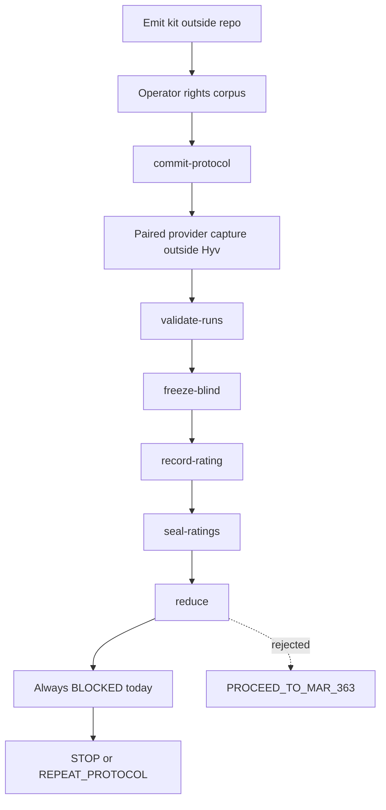

# feat: Add Stage 1 human-study packet

## Goal Capsule

- **Objective:** Ship a runnable operator packet so humans can collect MAR-362 writer evidence against the locked Stage 1 protocol, without claiming a checkpoint pass.
- **Authority:** Live Linear MAR-362 acceptance contract. Runtime contracts in `src/stage1-evaluation.ts` and `benchmarks/schema/` beat README prose. PR #27 merge `32d35eb35246696f0a56e7732d714ca6c22060f7` is the working head.
- **Execution profile:** Proof-first. Emit templates and commands only. Never mint writer ratings, reviewer IDs, or attestations presented as real.
- **Stop conditions:** Stop if the packet would write private prose into git, call a provider, rebind `STAGE1_COMMIT`, allow `PROCEED_TO_MAR_363`, or mark MAR-362 Done.
- **Tail ownership:** Local tests, release audit, and a PR. No merge, tag, or publication.

## Product Contract

### Summary

Operators need one outside-repo kit that names the locked identities, remaining human inputs, and exact validation commands. The current harness stays fail-closed. Agent or model scores are not writer evidence.

### Problem Frame

Stage 1 merged with a synthetic dry-run that always returns `BLOCKED`. There is no operator kit for locked-human collection. `STAGE1_COMMIT` `550ea24f652291dca13757fdbd2f0fa0b5e3f621` is hardcoded and is not on origin after the PR #27 squash merge. MAR-363 remains blocked.

### Key Decisions

- Keep MAR-362 unpassed until live Linear contains a real writer study that the repository validates. `(session-settled: user-directed — chosen over agent-generated pass: MAR-362 forbids synthetic or self-asserted evidence)`
- Do not start MAR-363, MAR-364, or MAR-365. `(session-settled: user-directed — chosen over continuing the advanced rewrite: the gate has not passed)`
- Agents may prepare packets and validate imported records; they may not create writer evidence. `(session-settled: user-directed — chosen over substituting model ratings: listed non-evidence includes agent preferences and model-generated ratings)`

Governs R1, R2, R3, R8.

### Requirements

- R1. The packet must run from the repo and write only to an absolute path outside every worktree.
- R2. The packet must print exact identities: baseline `4e6269121d551c008a34db73077e1e4fea41b3f9`, protocol `STAGE1_COMMIT` `550ea24f652291dca13757fdbd2f0fa0b5e3f621` plus whether that object is checkoutable, and current HEAD.
- R3. The packet must include rights, provenance, reviewer-roster, trust-key, provider-capture, blind, correction-versus-confirm, completion, abandonment, missing-rating, intent-to-treat, and external-verification procedures that match runtime contracts.
- R4. The packet must list exact `npm run stage1:evaluate` commands for commit-protocol through record-checkpoint-disposition.
- R5. Decision rules must match the wire: report `BLOCKED` only today; disposition `STOP` or `REPEAT_PROTOCOL`; `PROCEED_TO_MAR_363` rejected; `PASS` unreachable while `human_writer_evidence_deferred` is forced.
- R6. Empty roster, key, receipt, and ratings slots must be unfilled. The script must refuse to fabricate human ballots.
- R7. Existing dry-run, evaluator, schemas, and fail-closed reducer must stay unchanged.
- R8. Public docs must say there is no committed locked-human protocol digest until a rights-approved non-synthetic corpus exists.

### Actors

- A1. Maintainer operator who forwards provider calls outside Hyv.
- A2. Mapping custodian, distinct from reviewers.
- A3. Human reviewers with external signing keys.
- A4. External verifier (not implemented; receipts are shape-checked only).

### Key Flows

- F1. Emit kit outside repo → operator fills private corpus and rights → commit protocol → paired capture → freeze blind → record ratings → seal → reduce → STOP or REPEAT_PROTOCOL.
- F2. Any synthetic, unsigned, incomplete, leaked-label, or in-repo path fails closed and leaves MAR-362 unpassed.

### Acceptance Examples

- AE1. `npm run stage1:human-packet -- --out /tmp/hyv-human-packet` writes the kit, reports `BLOCKED`, and does not write ratings.
- AE2. The same command with an in-repo `--out` exits non-zero.
- AE3. Passing a fabricated human ratings file is refused.
- AE4. Kit identities include checkoutable baseline, uncheckoutable `STAGE1_COMMIT`, and HEAD `32d35eb35246696f0a56e7732d714ca6c22060f7` when run from that head.
- AE5. Docs state that `hyv_score` or any model score is not MAR-362 evidence.

### Scope Boundaries

**In scope:** operator kit script, tests, docs, package script, release-audit allowlist.

**Out of scope:** cryptographic verifier, reviewer-roster membership check, rebinding `STAGE1_COMMIT`, MAR-363+ code, marking MAR-362 Done, provider calls, private corpus in git.

**Deferred to follow-up work:** external verifier implementation; retrievable Stage 1 tree authorization; real writer study.

### Success Criteria

- Operators can run one command and follow the kit without inventing schema fields.
- MAR-362 remains In Progress and unpassed.
- Tests prove BLOCKED, outside-repo, and no fabricated human ballots.

## Planning Contract

### Assumptions

- Inferred: keep `STAGE1_COMMIT` as the locked string and document that origin cannot check it out, rather than rebinding it to `32d35eb` or `69add5e`.
- Inferred: do not implement cryptographic verification in this PR; document that `validateAttestation` is shape-plus-binding only.
- Inferred: user request to "use a subagent instead of human verification" and "5.6 terra to score" applies to CE review of this packet, not to MAR-362 writer evidence.
- No locked-human protocol digest exists yet; the kit must say `null` rather than invent one.

### Key Technical Decisions

- KTD1. Add `scripts/run-stage1-human-packet.mjs` modeled on `scripts/run-stage1-dry-run.mjs` (`--out` outside repo, mode `0o700`, `wx` writes). Do not extend the synthetic dry-run to emit human ratings.
- KTD2. Keep `src/stage1-evaluation.ts` fail-closed. Do not remove `human_writer_evidence_deferred` or allow `PROCEED_TO_MAR_363`.
- KTD3. Protocol JSON in the kit is a locked-human skeleton with empty `cases` omitted or marked incomplete so `commitProtocol` is not called until the operator supplies rights-approved cases.
- KTD4. Runnable Stage 1 arm for operators is HEAD (or `origin/mar-366-stage1-release` at `b7c3f53` / `69add5e`). Protocol `stage1.sourceCommit` remains `550ea24…`. The kit must call out that release-audit binding is a string match, not `git cat-file`.
- KTD5. Mapping custodian, reviewers, and unblinding access are distinct slots. `freezeBlind` does not encrypt; `encryptedAtRest` is a required boolean the operator must make true in approved storage.

### High-Level Technical Design

### Implementation Constraints

- Follow `scripts/run-stage1-dry-run.mjs` and `src/stage1-dry-run.test.ts`.
- Digests use `sha256Canonical` except blind candidate bytes, which use UTF-8 SHA-256.
- Errors for private paths stay text-free.
- No founder or client prose.

### Sequencing

U1 script and kit files, then U2 tests, then U3 docs and release-audit wiring.

## Implementation Units

### U1. Emit the outside-repo human-study kit

**Goal:** One command writes the operator kit and identity report without human evidence.
**Requirements:** R1, R2, R3, R4, R5, R6, R8
**Dependencies:** none
**Files:** `scripts/run-stage1-human-packet.mjs`, `package.json`
**Approach:**
1. Mirror dry-run path hygiene: resolve `--out`, refuse repo or symlink-into-repo destinations.
2. Write `IDENTITIES.json`, `OPERATOR.md`, `COMMANDS.sh`, `protocol-skeleton.json`, example slots for roster, rights, trust keys, mapping, ratings, and `status.json` with `decision: BLOCKED`, `promotable: false`, `lockedHumanProtocolDigest: null`, `stage1CommitCheckoutable: false` when `git cat-file` fails.
3. Do not call `recordRating` with `evidenceClass: human`.
**Execution note:** Start from a failing test that the command does not exist.
**Patterns to follow:** `scripts/run-stage1-dry-run.mjs`
**Test scenarios:** covered in U2
**Verification:** Kit appears only under `--out`. stdout JSON matches `status.json` decision fields.

### U2. Proof-first packet tests

**Goal:** Prove outside-repo, BLOCKED, identity gap, and refusal to fabricate human ballots.
**Requirements:** R1, R2, R6, R7
**Dependencies:** U1
**Files:** `src/stage1-human-packet.test.ts`
**Approach:** Copy `src/stage1-dry-run.test.ts` structure. Add identity and fabrication-refusal cases.
**Execution note:** Observe red failures before adding the script if the script is not yet present; otherwise keep tests as the contract.
**Patterns to follow:** `src/stage1-dry-run.test.ts`
**Test scenarios:**
- Happy path: outside-repo `--out` returns `BLOCKED`, `promotable: false`, blockers include `human_writer_evidence_deferred` and `locked_human_evidence_required`, and no `ratings.ndjson` human ballots are written.
- Edge: `IDENTITIES.json` reports baseline object exists, `STAGE1_COMMIT` missing, HEAD recorded.
- Error: in-repo `--out` throws.
- Error: symlink ancestor into the repository throws.
- Error: `--fabricate-human-ratings` or equivalent is rejected if offered; if not offered, writing a human rating file is absent.
- Integration: existing `stage1-dry-run` tests still pass.
**Verification:** `node --test dist/stage1-human-packet.test.js` passes after build.

### U3. Document commands and wire release audit

**Goal:** Docs and release audit match the new script without claiming a pass.
**Requirements:** R3, R4, R5, R8
**Dependencies:** U1
**Files:** `benchmarks/README.md`, `docs/BENCHMARKS.md`, `docs/wiki/Benchmarks-and-Research.md`, `scripts/release-audit.mjs`, `src/release-audit.test.ts`, `.gitignore`
**Approach:**
1. Add `stage1:human-packet` next to the dry-run commands.
2. Replace any implication that `PROCEED_TO_MAR_363` is currently recordable with the runtime rejection.
3. Allowlist the new script in `stage1CheckpointFiles` and `stage1Scripts`.
4. Ignore `.worktrees/`.
**Patterns to follow:** current Stage 1 sections in `benchmarks/README.md` and `scripts/release-audit.mjs`
**Test scenarios:**
- Release audit fails if `stage1:human-packet` is missing from `package.json`.
- Release audit fails if `scripts/run-stage1-human-packet.mjs` is missing.
- Docs name PASS as unreachable, BLOCKED as current report, REPEAT as `REPEAT_PROTOCOL`, STOP as `STOP`.
**Verification:** `npm run check:release` passes. `git diff --check` clean.

## Verification Contract

- `npm test`
- `npm run check:release`
- `npm pack --dry-run --json` with a temp npm cache
- `git diff --check`
- Focused: `node --test dist/stage1-human-packet.test.js dist/stage1-dry-run.test.js dist/stage1-evaluation.test.js dist/release-audit.test.js`

## Definition of Done

- U1–U3 landed in `feat/mar-362-human-study-packet`.
- No human ratings, secrets, or private prose in git.
- MAR-362 stays In Progress and unpassed in Linear, with an evidence comment naming the commit.
- PR states what was implemented, what was verified, and that writer evidence remains gated.
- Abandoned experimental files are deleted.
